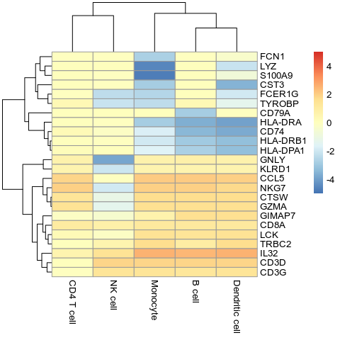
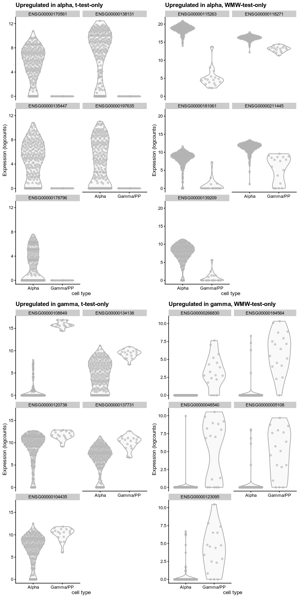
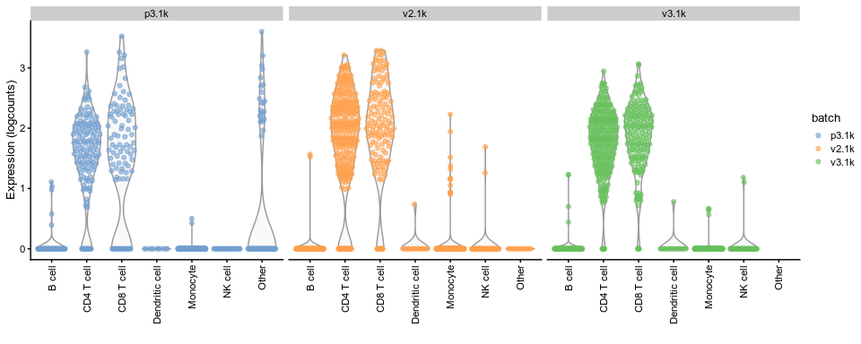

Differential Expression
================

Created by: Ahmed Mahfouz Edited by: Mohammed Charrout, Lieke Michielsen

# Overview

In this tutorial we will explore different methods to perform
differential expression analysis on scRNA-seq data. The exercises are
based on Seurat’s differential expression testing
[vignette](https://satijalab.org/seurat/articles/de_vignette.html).

Load required packages:

``` r
require(Seurat)
require(scran)
require(scater)
require(pheatmap)
```

We will continue with our PBMC dataset.

``` r
pbmc <- readRDS(file = "../session-clustering/pbmc3k.rds")
```

## Differential expression testing in Seurat

In Seurat, differential expression analysis can be performed using the
`FindMarkers` function. As a default, Seurat performs differential
expression based on the non-parameteric Wilcoxon rank sum test.
Differential expression is performed between groups of cells. To test
for differential expression between two specific groups of cells,
specify the `ident.1` and `ident.2` parameters. The function will
automatically retrieve the cluster identities from the Seurat object
using the `Idents()` function.

Before applying the function, we first have to change the identities to
the original `celltype` column, as we have changed them in the
clustering lab.

``` r
levels(pbmc)
```

    ## [1] "NK and T cells" "Monocytes"      "B cells"

``` r
Idents(pbmc) <- 'celltype'
levels(pbmc)
```

    ## [1] "Monocyte"       "B cell"         "CD8 T cell"     "CD4 T cell"    
    ## [5] "NK cell"        "Dendritic cell"

``` r
# Find differentially expressed features between CD8 and CD4 T-cells
tcell.de.markers <- FindMarkers(pbmc, ident.1 = "CD8 T cell", ident.2 = "CD4 T cell")
# View results
head(tcell.de.markers)
```

    ##             p_val avg_log2FC pct.1 pct.2    p_val_adj
    ## NKG7 7.901233e-61   3.843329 0.741 0.027 2.649915e-56
    ## CD8A 2.501225e-55   1.986264 0.695 0.020 8.388608e-51
    ## CTSW 1.230991e-54   1.991361 0.925 0.314 4.128497e-50
    ## CCL5 2.573606e-50   3.067194 0.764 0.109 8.631360e-46
    ## GZMA 2.840748e-45   2.570760 0.707 0.109 9.527300e-41
    ## CST7 4.187390e-41   2.194723 0.609 0.058 1.404367e-36

The results data frame has the following columns:

-   `p_val`: Unadjusted p-value  
-   `avg_log2FC`: log fold-change of the average expression between the
    two groups. Positive values indicate that the feature is more highly
    expressed in the first group.  
-   `pct.1`: The percentage of cells where the feature is detected in
    the first group.  
-   `pct.2`: The percentage of cells where the feature is detected in
    the second group.  
-   `p_val_adj`: Adjusted p-value, based on Bonferroni correction using
    all features in the dataset.

If the ident.2 parameter is omitted or set to NULL, `FindMarkers` will
test for differentially expressed features between the group specified
by ident.1 and all other cells.

``` r
# Find differentially expressed features between CD8 T-cells and all other cells, only
# search for positive markers
tcell.de.markers <- FindMarkers(pbmc, ident.1 = "CD8 T cell", ident.2 = NULL, only.pos = TRUE)
# view results
head(tcell.de.markers)
```

    ##               p_val avg_log2FC pct.1 pct.2     p_val_adj
    ## CD8A  1.068397e-126   1.961412 0.695 0.022 3.583191e-122
    ## CD8B   4.247617e-98   1.901227 0.523 0.011  1.424566e-93
    ## CCL5   6.657331e-89   2.550836 0.764 0.101  2.232736e-84
    ## GZMK   9.705468e-88   2.580187 0.615 0.050  3.255020e-83
    ## CTSW   6.102467e-87   1.482927 0.925 0.184  2.046645e-82
    ## TRGC2  3.555947e-72   1.823488 0.546 0.053  1.192593e-67

To increase the speed of marker discovery, particularly for large
datasets, Seurat allows for pre-filtering of features or cells. For
example, features that are very infrequently detected in either group of
cells, or features that are expressed at similar average levels, are
unlikely to be differentially expressed. Example use cases of the
`min.pct`, `logfc.threshold`, `min.diff.pct`, and `max.cells.per.ident`
parameters are demonstrated below.

``` r
# Pre-filter features that are detected at <50% frequency in either CD8 T-cells or CD4 T-cells. 
head(FindMarkers(pbmc, ident.1 = "CD8 T cell", ident.2 = "CD4 T cell", min.pct = 0.5))
```

    ##             p_val avg_log2FC pct.1 pct.2    p_val_adj
    ## NKG7 7.901233e-61   3.843329 0.741 0.027 2.649915e-56
    ## CD8A 2.501225e-55   1.986264 0.695 0.020 8.388608e-51
    ## CTSW 1.230991e-54   1.991361 0.925 0.314 4.128497e-50
    ## CCL5 2.573606e-50   3.067194 0.764 0.109 8.631360e-46
    ## GZMA 2.840748e-45   2.570760 0.707 0.109 9.527300e-41
    ## CST7 4.187390e-41   2.194723 0.609 0.058 1.404367e-36

``` r
# Pre-filter features that have less than a two-fold change between the average expression of
# CD8 T-cells vs CD4 T-cells.
head(FindMarkers(pbmc, ident.1 = "CD8 T cell", ident.2 = "CD4 T cell", logfc.threshold = log(2)))
```

    ##             p_val avg_log2FC pct.1 pct.2    p_val_adj
    ## NKG7 7.901233e-61   3.843329 0.741 0.027 2.649915e-56
    ## CD8A 2.501225e-55   1.986264 0.695 0.020 8.388608e-51
    ## CTSW 1.230991e-54   1.991361 0.925 0.314 4.128497e-50
    ## CCL5 2.573606e-50   3.067194 0.764 0.109 8.631360e-46
    ## GZMA 2.840748e-45   2.570760 0.707 0.109 9.527300e-41
    ## CST7 4.187390e-41   2.194723 0.609 0.058 1.404367e-36

``` r
# Pre-filter features whose detection percentages across the two groups are similar (within 0.25)
head(FindMarkers(pbmc, ident.1 = "CD8 T cell", ident.2 = "CD4 T cell", min.diff.pct = 0.25))
```

    ##             p_val avg_log2FC pct.1 pct.2    p_val_adj
    ## NKG7 7.901233e-61   3.843329 0.741 0.027 2.649915e-56
    ## CD8A 2.501225e-55   1.986264 0.695 0.020 8.388608e-51
    ## CTSW 1.230991e-54   1.991361 0.925 0.314 4.128497e-50
    ## CCL5 2.573606e-50   3.067194 0.764 0.109 8.631360e-46
    ## GZMA 2.840748e-45   2.570760 0.707 0.109 9.527300e-41
    ## CST7 4.187390e-41   2.194723 0.609 0.058 1.404367e-36

Finally, you can also identify all cluster markers in one go using
`FindAllMarkers`.

``` r
head(FindAllMarkers(pbmc, logfc.threshold = log(2), min.pct = 0.5, min.diff.pct = 0.25))
```

    ## Calculating cluster Monocyte

    ## Calculating cluster B cell

    ## Calculating cluster CD8 T cell

    ## Calculating cluster CD4 T cell

    ## Calculating cluster NK cell

    ## Calculating cluster Dendritic cell

    ##                  p_val avg_log2FC pct.1 pct.2     p_val_adj  cluster     gene
    ## FCN1     2.665083e-214   4.058224 0.994 0.012 8.938154e-210 Monocyte     FCN1
    ## SERPINA1 3.087393e-212   2.907682 0.982 0.008 1.035450e-207 Monocyte SERPINA1
    ## FGL2     3.210232e-203   2.984234 0.991 0.042 1.076648e-198 Monocyte     FGL2
    ## MNDA     9.642581e-203   3.649053 0.979 0.032 3.233929e-198 Monocyte     MNDA
    ## CSTA     1.058587e-200   2.552211 0.955 0.012 3.550290e-196 Monocyte     CSTA
    ## VCAN     2.667989e-199   4.023919 0.943 0.012 8.947902e-195 Monocyte     VCAN

### Alternative DE tests in Seurat

The following differential expression tests are currently supported by
Seurat:

-   `wilcox`: Wilcoxon rank sum test (default)  
-   `bimod`: Likelihood-ratio test for single cell feature expression,
    (McDavid et al., Bioinformatics, 2013)  
-   `roc`: Standard AUC classifier  
-   `t`: Student’s t-test  
-   `poisson`: Likelihood ratio test assuming an underlying negative
    binomial distribution.  
-   `negbinom`: Likelihood ratio test assuming an underlying negative
    binomial distribution.  
-   `LR`: Uses a logistic regression framework to determine
    differentially expressed genes. Constructs a logistic regression
    model predicting group membership based on each feature individually
    and compares this to a null model with a likelihood ratio test.  
-   `MAST`: GLM-framework that treates cellular detection rate as a
    covariate (Finak et al, Genome Biology, 2015)  
-   `DESeq2`: DE based on a model using the negative binomial
    distribution (Love et al, Genome Biology, 2014)

For MAST and DESeq2 please ensure that these packages are installed
separately in order to use them as part of Seurat. Once installed, the
`test.use` parameter can be used to specify which DE test to use.

``` r
# Test for DE features using the MAST package
head(FindMarkers(pbmc, ident.1 = "CD8 T cell", ident.2 = "CD4 T cell", test.use = "MAST"))
```

    ## 
    ## Done!

    ## Combining coefficients and standard errors

    ## Calculating log-fold changes

    ## Calculating likelihood ratio tests

    ## Refitting on reduced model...

    ## 
    ## Done!

    ##             p_val avg_log2FC pct.1 pct.2    p_val_adj
    ## NKG7 1.612892e-70   3.843329 0.741 0.027 5.409316e-66
    ## CTSW 1.057055e-62   1.991361 0.925 0.314 3.545151e-58
    ## CD8A 1.542649e-60   1.986264 0.695 0.020 5.173736e-56
    ## CCL5 1.235283e-54   3.067194 0.764 0.109 4.142893e-50
    ## GZMA 1.773035e-50   2.570760 0.707 0.109 5.946406e-46
    ## CST7 9.422093e-44   2.194723 0.609 0.058 3.159982e-39

## Differential expression analysis using scran

The `findMarkers()` function in scran uses a different approach to
identify marker genes compared to Seurat. While in Seurat the default is
to perform one vs all comparisons, `findMarkers()` in scran performs
pairwise comparisons between clusters for each gene. The default test in
`findMarkers()` is the Welch t-test.

Scran intentionally uses pairwise comparisons between clusters rather
than comparing each cluster to the average of all other cells. The
latter approach is sensitive to the population composition, potentially
resulting in substantially different sets of markers when cell type
abundances change in different contexts. In the worst case, the presence
of a single dominant subpopulation will drive the selection of top
markers for every other cluster, pushing out useful genes that can
resolve the various minor subpopulations.

First, let’s convert our Seurat object to a SingleCellExperiment object.

``` r
pbmc.sce <- as.SingleCellExperiment(pbmc)
```

`findMarkers()` returns a list of data frames containing ranked
candidate markers for each cluster.

``` r
markers.pbmc <- findMarkers(pbmc.sce, groups=pbmc.sce$ident)
```

You can then choose one data frame (in this example, corresponding to
CD8 T-cells). This data frame contains log2-fold changes of expression
in the chosen cluster over each other cluster as well as several
statistics obtained by combining p-values across the pairwise
comparisons involving the cluster of interest.

``` r
chosen <- "CD8 T cell"
interesting <- markers.pbmc[[chosen]]
interesting[1:10,1:4]
```

    ## DataFrame with 10 rows and 4 columns
    ##                Top      p.value          FDR summary.logFC
    ##          <integer>    <numeric>    <numeric>     <numeric>
    ## HLA-DRB1         1 6.03248e-176 1.12398e-172      -2.95127
    ## CTSW             1  2.43221e-72  4.77027e-70       1.65306
    ## CD3D             1  5.83999e-96  1.99859e-93       1.83222
    ## IL32             1  1.13157e-97  4.12505e-95       2.47244
    ## CST3             1  0.00000e+00  0.00000e+00      -2.86031
    ## LCK              2  2.74067e-75  5.81750e-73       1.44093
    ## FCER1G           2 7.94116e-310 1.33165e-305      -2.58399
    ## CD3G             2  4.02478e-61  5.79326e-59       1.29761
    ## CCL5             2  1.35929e-47  1.36490e-45       2.03777
    ## CD79A            2 6.39837e-171 1.12941e-167      -2.84229

The `summary.logFC` field provides a summary of the direction and effect
size for each gene. `logFC` is defined here as the log-fold change from
the comparison with the lowest p-value. The `p.value` field contains the
combined p-value that is obtained by applying Simes’ method to the
pairwise p-values for each gene. Of particular interest is the `Top`
field. The set of genes with `Top`  ≤ *X* is the union of the top *X*
genes (ranked by p-value) from each pairwise comparison involving the
cluster of interest.

Let’s plot a heatmap of the top 5 genes for CD8 T-cells.

``` r
best.set <- interesting[interesting$Top <= 5,]
logFCs <- getMarkerEffects(best.set)
pheatmap(logFCs, breaks=seq(-5, 5, length.out=101))
```

<!-- -->

### Wilcoxon vs t-test

Also in scran, you can use different DE tests. Beside the default Welch
t-test, you can also use a Wilcoxon rank-sum test or a binomial test.

``` r
markers.pbmc.wrs <- findMarkers(pbmc.sce, groups=pbmc.sce$ident, test="wilcox")
interesting.wrs <- markers.pbmc.wrs[[chosen]]
interesting.wrs[1:10,1:4]
```

    ## DataFrame with 10 rows and 4 columns
    ##              Top      p.value         FDR summary.AUC
    ##        <integer>    <numeric>   <numeric>   <numeric>
    ## FCER1G         1  1.16092e-78 3.89351e-75 1.72586e-05
    ## MARCH1         1  2.87753e-64 9.94913e-62 5.70571e-02
    ## CD3E           1 3.22427e-103 1.08136e-98 9.97101e-01
    ## CD79A          1  8.03182e-66 3.28502e-63 0.00000e+00
    ## NKG7           1  3.95062e-60 1.01920e-57 8.66100e-01
    ## CD8A           2  1.13117e-65 4.57073e-63 8.47701e-01
    ## KLRF1          2  2.29872e-32 1.59947e-30 4.91071e-02
    ## RNASE6         2  9.78777e-40 9.71190e-38 2.94118e-02
    ## IL32           2  1.48340e-99 1.72695e-95 9.88092e-01
    ## TGFBI          3  1.60505e-62 5.03085e-60 6.32270e-02

One advantage of the Wilcoxon rank-sum test over the Welch t-test is
that it is symmetric with respect to differences in the size of the
groups being compared. In other words, it is less affected by the number
of cells in each group. On the other hand, the t-test will favor genes
where the larger group has the higher relative variance as this
increases the estimated degrees of freedom and decreases the resulting
p-value.

To illustrate this we will use an example from [“Orchestrating
Single-Cell Analysis with
Bioconductor”](https://osca.bioconductor.org/marker-detection.html). In
this example, we will compare alpha and gamma cells in the human
pancreas data set from Lawlor et al. (2017)

``` r
sce.lawlor <- readRDS(file = "sce_lawlor.rds")
marker.lawlor.t <- findMarkers(sce.lawlor, groups=sce.lawlor$`cell type`, 
                               direction="up", restrict=c("Alpha", "Gamma/PP"))
marker.lawlor.w <- findMarkers(sce.lawlor, groups=sce.lawlor$`cell type`, 
                               direction="up", restrict=c("Alpha", "Gamma/PP"), test.type="wilcox")
# Upregulated in alpha:
marker.alpha.t <- marker.lawlor.t$Alpha
marker.alpha.w <- marker.lawlor.w$Alpha
chosen.alpha.t <- rownames(marker.alpha.t)[1:5]
chosen.alpha.w <- rownames(marker.alpha.w)[1:5]
u.alpha.t <- setdiff(chosen.alpha.t, chosen.alpha.w)
u.alpha.w <- setdiff(chosen.alpha.w, chosen.alpha.t)
# Upregulated in gamma:
marker.gamma.t <- marker.lawlor.t$`Gamma/PP`
marker.gamma.w <- marker.lawlor.w$`Gamma/PP`
chosen.gamma.t <- rownames(marker.gamma.t)[1:5]
chosen.gamma.w <- rownames(marker.gamma.w)[1:5]
u.gamma.t <- setdiff(chosen.gamma.t, chosen.gamma.w)
u.gamma.w <- setdiff(chosen.gamma.w, chosen.gamma.t)
# Examining all uniquely detected markers in each direction.
subset <- sce.lawlor[,sce.lawlor$`cell type` %in% c("Alpha", "Gamma/PP")]
gridExtra::grid.arrange(
  plotExpression(subset, x="cell type", features=u.alpha.t, ncol=2) +
    ggtitle("Upregulated in alpha, t-test-only"),
  plotExpression(subset, x="cell type", features=u.alpha.w, ncol=2) +
    ggtitle("Upregulated in alpha, WMW-test-only"),
  plotExpression(subset, x="cell type", features=u.gamma.t, ncol=2) +
    ggtitle("Upregulated in gamma, t-test-only"),
  plotExpression(subset, x="cell type", features=u.gamma.w, ncol=2) +
    ggtitle("Upregulated in gamma, WMW-test-only"),
  ncol=2
)
```

<!-- -->

Can you observe the effects of the tests in the resulting genes?

## DE testing for integrated data

Nowadays, it is common to work with multiple scRNA-seq datasets. As we
have seen in the integration practical, several strategies exist to
integrate multiple datasets and perform cell-based analysis
(e.g. clustering or trajectory inference) using the integrated data
(i.e. data corrected for batch effects).

But what about gene-based analysis? Can we use the integrated
(i.e. corrected) data for differential expression analysis? In general,
this is not recommended. The reason is that arbitrary correction
algorithms do not preserve the magnitude or the direction of differences
in per-gene expression when attempting to align multiple batches.
Further, the correction can introduce artificial agreement across
batches. For a good discussion of these implications, check [chapter
13.7](https://osca.bioconductor.org/integrating-datasets.html#using-corrected-values)
in [“Orchestrating Single-Cell Analysis with
Bioconductor”](https://osca.bioconductor.org/marker-detection.html).

For these reasons, it is preferred to perform DE testing using the
uncorrected expression data. There are two strategies to handle the
batch effects in this case.

### Identifying conserved markers (Seurat)

To identify canonical cell type marker genes that are conserved across
batches, Seurat provides the `FindConservedMarkers` function. This
function performs differential gene expression testing for each
dataset/group/batch separately and combines the p-values using
meta-analysis methods from the `MetaDE` R package.

To illustrate this, we will again load in the other PBMC datasets and
merge them with our PBMC dataset. The cell type labels from the
integration practical will be used again to identify the cell
populations.

``` r
# Load and process v2.1k dataset
v2.1k <- Read10X_h5("../session-qc-normalization/pbmc_1k_v2_filtered_feature_bc_matrix.h5")
meta.data <- read.table('../session-integration/celltypes_1k_v2.tsv', sep = '\t', header = TRUE, row.names = 1)
v2.1k <- CreateSeuratObject(v2.1k, meta.data = meta.data, project = 'v2.1k')
v2.1k <- NormalizeData(v2.1k)

# Load and process p3.1k dataset
p3.1k <- Read10X_h5("../session-qc-normalization/pbmc_1k_protein_v3_filtered_feature_bc_matrix.h5")
```

    ## Genome matrix has multiple modalities, returning a list of matrices for this genome

``` r
meta.data <- read.table('../session-integration/celltypes_1k_protein.tsv', sep = '\t', header = TRUE, row.names = 1)
p3.1k <- CreateSeuratObject(p3.1k$`Gene Expression`, meta.data = meta.data, project = 'p3.1k')
p3.1k <- NormalizeData(p3.1k)

# Merge
pbmc.all <- merge(x = pbmc, y = c(v2.1k, p3.1k), add.cell.ids = c("v3.1k", "v2.1k", "p3.1k"))
pbmc.all <- AddMetaData(pbmc.all, sub("_.*", "", colnames(pbmc.all)), "batch")
Idents(pbmc.all) <- 'celltype'
table(pbmc.all[[c("batch", "celltype")]])
```

    ##        celltype
    ## batch   B cell CD4 T cell CD8 T cell Dendritic cell Monocyte NK cell Other
    ##   p3.1k     80        145         97             11      245      31   104
    ##   v2.1k    142        300        137             16      322      65    14
    ##   v3.1k    181        293        174             17      333      56     0

Now find the conserved markers for CD8 T-cells by batch.

``` r
cd8.markers <- FindConservedMarkers(pbmc.all, ident.1 = "CD8 T cell", grouping.var = "batch", 
                                    logfc.threshold = 0.1, min.pct = 0.25, min.diff.pct = 0.25)
```

    ## Testing group p3.1k: (CD8 T cell) vs (B cell, CD4 T cell, Monocyte, Dendritic cell, Other, NK cell)

    ## Testing group v2.1k: (CD8 T cell) vs (Monocyte, CD4 T cell, NK cell, Other, B cell, Dendritic cell)

    ## Testing group v3.1k: (CD8 T cell) vs (Monocyte, B cell, CD4 T cell, NK cell, Dendritic cell)

``` r
head(cd8.markers, n=10)
```

    ##        p3.1k_p_val p3.1k_avg_log2FC p3.1k_pct.1 p3.1k_pct.2 p3.1k_p_val_adj
    ## CD8A  5.606455e-46         1.543765       0.474       0.029    1.880293e-41
    ## CD8B  9.689188e-33         1.295638       0.320       0.016    3.249560e-28
    ## CCL5  2.644436e-44         2.656488       0.670       0.112    8.868911e-40
    ## GZMK  1.630749e-43         2.059469       0.485       0.037    5.469207e-39
    ## CTSW  7.522387e-28         1.287593       0.619       0.138    2.522858e-23
    ## TRGC2 1.445072e-32         1.323161       0.412       0.042    4.846484e-28
    ## KLRG1 7.329561e-27         1.274761       0.526       0.104    2.458188e-22
    ## GZMA  5.359275e-31         1.395253       0.515       0.073    1.797394e-26
    ## NKG7  6.793357e-26         1.292141       0.557       0.119    2.278356e-21
    ## IL32  8.959317e-27         1.585711       0.773       0.255    3.004776e-22
    ##        v2.1k_p_val v2.1k_avg_log2FC v2.1k_pct.1 v2.1k_pct.2 v2.1k_p_val_adj
    ## CD8A  5.924812e-84         1.944534       0.533       0.021    1.987063e-79
    ## CD8B  5.977072e-90         2.100184       0.526       0.014    2.004590e-85
    ## CCL5  1.482409e-67         2.327723       0.774       0.135    4.971704e-63
    ## GZMK  7.670258e-71         2.234174       0.496       0.027    2.572451e-66
    ## CTSW  3.568178e-54         1.431782       0.788       0.169    1.196695e-49
    ## TRGC2 7.867071e-55         1.960427       0.401       0.024    2.638458e-50
    ## KLRG1 1.306959e-39         1.436802       0.445       0.063    4.383279e-35
    ## GZMA  1.139184e-39         1.388649       0.620       0.123    3.820595e-35
    ## NKG7  3.273629e-52         1.170457       0.745       0.144    1.097910e-47
    ## IL32  8.653273e-56         1.830066       0.978       0.336    2.902135e-51
    ##         v3.1k_p_val v3.1k_avg_log2FC v3.1k_pct.1 v3.1k_pct.2 v3.1k_p_val_adj
    ## CD8A  1.068397e-126         1.961412       0.695       0.022   3.583191e-122
    ## CD8B   4.247617e-98         1.901227       0.523       0.011    1.424566e-93
    ## CCL5   6.657331e-89         2.550836       0.764       0.101    2.232736e-84
    ## GZMK   9.705468e-88         2.580187       0.615       0.050    3.255020e-83
    ## CTSW   6.102467e-87         1.482927       0.925       0.184    2.046645e-82
    ## TRGC2  3.555947e-72         1.823488       0.546       0.053    1.192593e-67
    ## KLRG1  5.363311e-72         1.782824       0.690       0.116    1.798747e-67
    ## GZMA   1.635706e-69         1.726378       0.707       0.105    5.485831e-65
    ## NKG7   2.496780e-69         1.621816       0.741       0.127    8.373701e-65
    ## IL32   9.307544e-66         1.823237       0.977       0.334    3.121564e-61
    ##           max_pval minimump_p_val
    ## CD8A  5.606455e-46  3.205192e-126
    ## CD8B  9.689188e-33   1.274285e-97
    ## CCL5  2.644436e-44   1.997199e-88
    ## GZMK  1.630749e-43   2.911640e-87
    ## CTSW  7.522387e-28   1.830740e-86
    ## TRGC2 1.445072e-32   1.066784e-71
    ## KLRG1 7.329561e-27   1.608993e-71
    ## GZMA  5.359275e-31   4.907119e-69
    ## NKG7  6.793357e-26   7.490340e-69
    ## IL32  8.959317e-27   2.792263e-65

### Identifying consistent markers (scran)

Alternatively, we can perform DE tests on the uncorrected data with
blocking on the batch. The rational here is that we expect true DE
between clusters to be present in a within-batch comparison where batch
effects are absent. This strategy penalizes genes that exhibit
inconsistent DE across batches.

``` r
pbmc.all.sce <- as.SingleCellExperiment(pbmc.all)
m.out <- findMarkers(pbmc.all.sce, group = pbmc.all.sce$celltype, block = pbmc.all.sce$batch,
    direction="up", lfc=1)
m.out$`CD8 T cell`[1:20, c("Top", "p.value", "FDR")]
```

    ## DataFrame with 20 rows and 3 columns
    ##             Top      p.value          FDR
    ##       <integer>    <numeric>    <numeric>
    ## RPS12         1  1.40573e-11  2.77325e-08
    ## CD3D          1  1.37286e-72  1.53477e-68
    ## IL32          1 5.88491e-125 1.97368e-120
    ## CCL5          1  1.28965e-44  7.20871e-41
    ## CD3E          2  5.53481e-79  9.28131e-75
    ## ...         ...          ...          ...
    ## RPS8          5  3.74089e-09  5.97438e-06
    ## GZMK          5  7.82838e-04  3.05289e-01
    ## TRBC2         5  5.66708e-26  1.68322e-22
    ## RPS27         6  3.98428e-09  6.07386e-06
    ## CD3G          6  6.02648e-05  2.80717e-02

``` r
plotExpression(pbmc.all.sce, x=I(factor(pbmc.all.sce$celltype)), 
    features="CD3D", colour_by="batch") + facet_wrap(~colour_by) +
  theme(axis.text.x = element_text(angle = 90, vjust = 0.5, hjust=1))
```

<!-- -->

### Session info

``` r
sessionInfo()
```

    ## R version 4.1.1 (2021-08-10)
    ## Platform: x86_64-conda-linux-gnu (64-bit)
    ## Running under: KDE neon User Edition 5.22
    ## 
    ## Matrix products: default
    ## BLAS/LAPACK: /home/mochar/miniconda3/envs/sc_course/lib/libopenblasp-r0.3.17.so
    ## 
    ## locale:
    ##  [1] LC_CTYPE=nl_NL.UTF-8       LC_NUMERIC=C              
    ##  [3] LC_TIME=nl_NL.UTF-8        LC_COLLATE=nl_NL.UTF-8    
    ##  [5] LC_MONETARY=nl_NL.UTF-8    LC_MESSAGES=nl_NL.UTF-8   
    ##  [7] LC_PAPER=nl_NL.UTF-8       LC_NAME=C                 
    ##  [9] LC_ADDRESS=C               LC_TELEPHONE=C            
    ## [11] LC_MEASUREMENT=nl_NL.UTF-8 LC_IDENTIFICATION=C       
    ## 
    ## attached base packages:
    ## [1] parallel  stats4    stats     graphics  grDevices utils     datasets 
    ## [8] methods   base     
    ## 
    ## other attached packages:
    ##  [1] pheatmap_1.0.12             scater_1.20.1              
    ##  [3] ggplot2_3.3.5               scran_1.20.1               
    ##  [5] scuttle_1.2.1               SingleCellExperiment_1.14.1
    ##  [7] SummarizedExperiment_1.22.0 Biobase_2.52.0             
    ##  [9] GenomicRanges_1.44.0        GenomeInfoDb_1.28.4        
    ## [11] IRanges_2.26.0              S4Vectors_0.30.0           
    ## [13] BiocGenerics_0.38.0         MatrixGenerics_1.4.3       
    ## [15] matrixStats_0.61.0          SeuratObject_4.0.2         
    ## [17] Seurat_4.0.4               
    ## 
    ## loaded via a namespace (and not attached):
    ##   [1] plyr_1.8.6                igraph_1.2.6             
    ##   [3] lazyeval_0.2.2            splines_4.1.1            
    ##   [5] BiocParallel_1.26.2       listenv_0.8.0            
    ##   [7] scattermore_0.7           digest_0.6.27            
    ##   [9] htmltools_0.5.2           viridis_0.6.1            
    ##  [11] fansi_0.5.0               magrittr_2.0.1           
    ##  [13] ScaledMatrix_1.0.0        tensor_1.5               
    ##  [15] cluster_2.1.2             ROCR_1.0-11              
    ##  [17] limma_3.48.3              globals_0.14.0           
    ##  [19] spatstat.sparse_2.0-0     prettyunits_1.1.1        
    ##  [21] colorspace_2.0-2          ggrepel_0.9.1            
    ##  [23] rbibutils_2.2.3           xfun_0.26                
    ##  [25] dplyr_1.0.7               crayon_1.4.1             
    ##  [27] RCurl_1.98-1.5            jsonlite_1.7.2           
    ##  [29] spatstat.data_2.1-0       survival_3.2-13          
    ##  [31] zoo_1.8-9                 glue_1.4.2               
    ##  [33] polyclip_1.10-0           gtable_0.3.0             
    ##  [35] zlibbioc_1.38.0           XVector_0.32.0           
    ##  [37] leiden_0.3.9              DelayedArray_0.18.0      
    ##  [39] BiocSingular_1.8.1        future.apply_1.8.1       
    ##  [41] abind_1.4-5               scales_1.1.1             
    ##  [43] edgeR_3.34.1              miniUI_0.1.1.1           
    ##  [45] Rcpp_1.0.7                metap_1.1                
    ##  [47] progress_1.2.2            viridisLite_0.4.0        
    ##  [49] xtable_1.8-4              reticulate_1.22          
    ##  [51] spatstat.core_2.3-0       dqrng_0.3.0              
    ##  [53] bit_4.0.4                 rsvd_1.0.5               
    ##  [55] metapod_1.0.0             htmlwidgets_1.5.4        
    ##  [57] httr_1.4.2                RColorBrewer_1.1-2       
    ##  [59] ellipsis_0.3.2            ica_1.0-2                
    ##  [61] farver_2.1.0              pkgconfig_2.0.3          
    ##  [63] uwot_0.1.10               deldir_0.2-10            
    ##  [65] locfit_1.5-9.4            utf8_1.2.2               
    ##  [67] labeling_0.4.2            tidyselect_1.1.1         
    ##  [69] rlang_0.4.11              reshape2_1.4.4           
    ##  [71] later_1.3.0               munsell_0.5.0            
    ##  [73] tools_4.1.1               generics_0.1.0           
    ##  [75] ggridges_0.5.3            evaluate_0.14            
    ##  [77] stringr_1.4.0             fastmap_1.1.0            
    ##  [79] yaml_2.2.1                goftest_1.2-2            
    ##  [81] bit64_4.0.5               knitr_1.34               
    ##  [83] fitdistrplus_1.1-5        purrr_0.3.4              
    ##  [85] RANN_2.6.1                pbapply_1.5-0            
    ##  [87] future_1.22.1             nlme_3.1-153             
    ##  [89] sparseMatrixStats_1.4.2   mime_0.11                
    ##  [91] hdf5r_1.3.4               compiler_4.1.1           
    ##  [93] beeswarm_0.4.0            plotly_4.9.4.1           
    ##  [95] png_0.1-7                 spatstat.utils_2.2-0     
    ##  [97] statmod_1.4.36            tibble_3.1.4             
    ##  [99] stringi_1.7.4             highr_0.9                
    ## [101] lattice_0.20-44           bluster_1.2.1            
    ## [103] Matrix_1.3-4              vctrs_0.3.8              
    ## [105] pillar_1.6.2              lifecycle_1.0.0          
    ## [107] Rdpack_2.1.2              spatstat.geom_2.2-2      
    ## [109] lmtest_0.9-38             RcppAnnoy_0.0.19         
    ## [111] BiocNeighbors_1.10.0      data.table_1.14.0        
    ## [113] cowplot_1.1.1             bitops_1.0-7             
    ## [115] irlba_2.3.3               httpuv_1.6.3             
    ## [117] patchwork_1.1.1           R6_2.5.1                 
    ## [119] promises_1.2.0.1          KernSmooth_2.23-20       
    ## [121] gridExtra_2.3             vipor_0.4.5              
    ## [123] parallelly_1.28.1         codetools_0.2-18         
    ## [125] MASS_7.3-54               MAST_1.18.0              
    ## [127] withr_2.4.2               sctransform_0.3.2        
    ## [129] GenomeInfoDbData_1.2.6    hms_1.1.1                
    ## [131] mgcv_1.8-36               grid_4.1.1               
    ## [133] rpart_4.1-15              beachmat_2.8.1           
    ## [135] tidyr_1.1.3               rmarkdown_2.11           
    ## [137] DelayedMatrixStats_1.14.3 Rtsne_0.15               
    ## [139] shiny_1.6.0               ggbeeswarm_0.6.0
