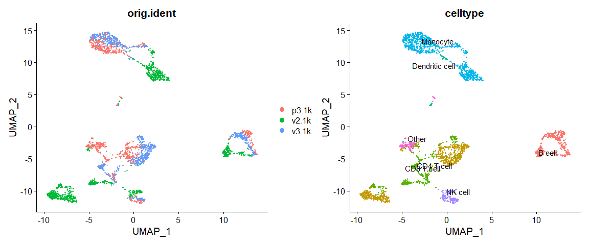
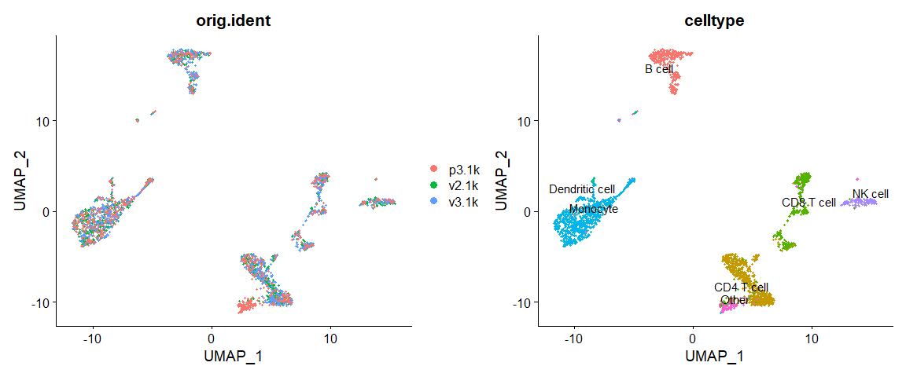
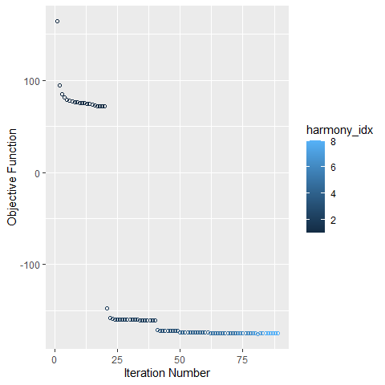
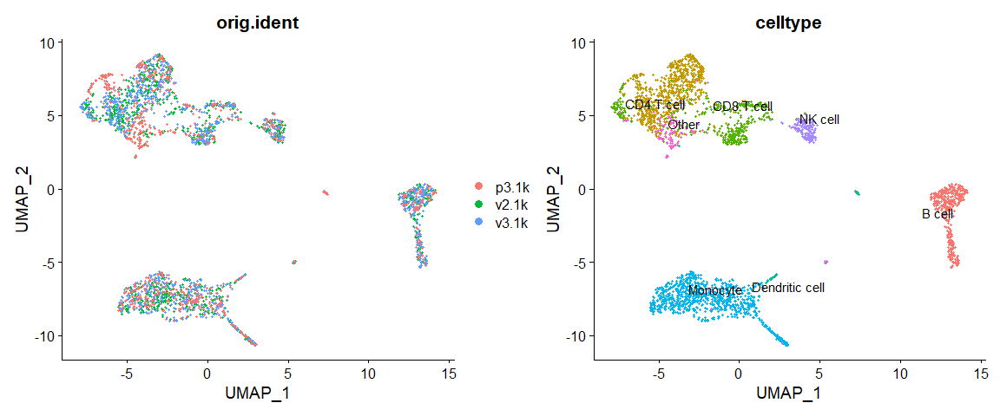

Data Integration
================

Created by: Ahmed Mahfouz

Edited by: Mohammed Charrout, Lieke Michielsen

# Overview

In this tutorial we will look at different ways of integrating multiple
single cell RNA-seq datasets. We will explore two different methods to
correct for batch effects across datasets. At the end of the session, we
will also show how to transfer cell type labels from a reference dataset
to a new dataset.

## Datasets

For this tutorial, we will use the 3 different PBMC datasets we also
started the normalization practical with.

Load required packages:

``` r
# Clear the workspace
rm(list=ls())

suppressMessages(require(Seurat))
suppressMessages(require(harmony))
```

## Seurat (anchors and CCA)

First we will use the data integration method presented in
[Comprehensive Integration of Single Cell
Data](https://www.sciencedirect.com/science/article/pii/S0092867419305598?via%3Dihub).

### Data preprocessing

First, we load the three datasets and some celltype labels.

``` r
pbmc_v3.1k <- readRDS('../session-clustering/pbmc3k.rds')
v2.1k <- Read10X_h5("../session-qc-normalization/pbmc_1k_v2_filtered_feature_bc_matrix.h5")
```

    ## Warning in sparseMatrix(i = indices[] + 1, p = indptr[], x = as.numeric(x =
    ## counts[]), : 'giveCsparse' has been deprecated; setting 'repr = "T"' for you

``` r
p3.1k <- Read10X_h5("../session-qc-normalization/pbmc_1k_protein_v3_filtered_feature_bc_matrix.h5")
```

    ## Warning in sparseMatrix(i = indices[] + 1, p = indptr[], x = as.numeric(x =
    ## counts[]), : 'giveCsparse' has been deprecated; setting 'repr = "T"' for you

    ## Genome matrix has multiple modalities, returning a list of matrices for this genome

``` r
p3.1k <- p3.1k$`Gene Expression`

pbmc_v2.1k <- CreateSeuratObject(v2.1k, project = "v2.1k")
pbmc_p3.1k <- CreateSeuratObject(p3.1k, project = "p3.1k")

labels_v2.1k = read.delim('celltypes_1k_v2.tsv', row.names = 1)
labels_p3.1k = read.delim('celltypes_1k_protein.tsv', row.names = 1)

pbmc_v2.1k <- AddMetaData(
    object = pbmc_v2.1k,
    metadata = labels_v2.1k)

pbmc_p3.1k <- AddMetaData(
    object = pbmc_p3.1k,
    metadata = labels_p3.1k)
```

Create a Seurat object with all datasets.

``` r
pbmc <- merge(pbmc_v2.1k, c(pbmc_v3.1k, pbmc_p3.1k), add.cell.ids=c("v2.1k","v3.1k","p3.1k"))
pbmc$orig.ident[pbmc$orig.ident == 'PBMC'] <- 'v3.1k'
```

Let’s first look at the datasets before applying any batch correction.
We perform standard preprocessing (log-normalization), and identify
variable features based on a variance stabilizing transformation
(`"vst"`). Next, we scale the integrated data, run PCA, and visualize
the results with UMAP. As you can see, the different batches do not
overlap in the UMAP.

``` r
# Normalize and find variable features
pbmc <- NormalizeData(pbmc, verbose = FALSE)
pbmc <- FindVariableFeatures(pbmc, selection.method = "vst", nfeatures = 2000, verbose = FALSE)
    
# Run the standard workflow for visualization and clustering
pbmc <- ScaleData(pbmc, verbose = FALSE)
pbmc <- RunPCA(pbmc, npcs = 30, verbose = FALSE)
pbmc <- RunUMAP(pbmc, reduction = "pca", dims = 1:30, verbose = FALSE)
```

    ## Warning: The default method for RunUMAP has changed from calling Python UMAP via reticulate to the R-native UWOT using the cosine metric
    ## To use Python UMAP via reticulate, set umap.method to 'umap-learn' and metric to 'correlation'
    ## This message will be shown once per session

``` r
p1 <- DimPlot(pbmc, reduction = "umap", group.by = "orig.ident")
p2 <- DimPlot(pbmc, reduction = "umap", group.by = "celltype", label = TRUE, repel = TRUE) + 
    NoLegend()
p1 + p2
```

<!-- -->

We split the combined object into a list, with each dataset as an
element. We perform standard preprocessing (log-normalization), and
identify variable features individually for each dataset based on a
variance stabilizing transformation (`"vst"`).

``` r
pbmc.list <- SplitObject(pbmc, split.by = "orig.ident")

for (i in 1:length(pbmc.list)) {
    pbmc.list[[i]] <- NormalizeData(pbmc.list[[i]], verbose = FALSE)
    pbmc.list[[i]] <- FindVariableFeatures(pbmc.list[[i]], selection.method = "vst", nfeatures = 2000, 
        verbose = FALSE)
}

### Select features that are repeatedly variable genes across the different dataset

features <- SelectIntegrationFeatures(pbmc.list)
```

### Integration of three PBMC datasets

We identify anchors using the `FindIntegrationAnchors` function, which
takes a list of Seurat objects as input.

``` r
pbmc.anchors <- FindIntegrationAnchors(pbmc.list, dims = 1:30)
```

    ## Computing 2000 integration features

    ## Scaling features for provided objects

    ## Finding all pairwise anchors

    ## Running CCA

    ## Merging objects

    ## Finding neighborhoods

    ## Finding anchors

    ##  Found 3031 anchors

    ## Filtering anchors

    ##  Retained 2717 anchors

    ## Running CCA

    ## Merging objects

    ## Finding neighborhoods

    ## Finding anchors

    ##  Found 2540 anchors

    ## Filtering anchors

    ##  Retained 2143 anchors

    ## Running CCA

    ## Merging objects

    ## Finding neighborhoods

    ## Finding anchors

    ##  Found 2554 anchors

    ## Filtering anchors

    ##  Retained 2182 anchors

We then pass these anchors to the `IntegrateData` function, which
returns a Seurat object.

``` r
pbmc.integrated <- IntegrateData(pbmc.anchors)
```

    ## Merging dataset 3 into 2

    ## Extracting anchors for merged samples

    ## Finding integration vectors

    ## Finding integration vector weights

    ## Integrating data

    ## Merging dataset 1 into 2 3

    ## Extracting anchors for merged samples

    ## Finding integration vectors

    ## Finding integration vector weights

    ## Integrating data

After running `IntegrateData`, the `Seurat` object will contain a new
`Assay` with the integrated (or ‘batch-corrected’) expression matrix.
Note that the original (uncorrected values) are still stored in the
object in the “RNA” assay, so you can switch back and forth.

We can then use this new integrated matrix for downstream analysis and
visualization. Here we scale the integrated data, run PCA, and visualize
the results with UMAP. The integrated datasets cluster by cell type,
instead of by technology.

``` r
# switch to integrated assay. The variable features of this assay are automatically set during
# IntegrateData
DefaultAssay(pbmc.integrated) <- "integrated"

# Run the standard workflow for visualization and clustering
pbmc.integrated <- ScaleData(pbmc.integrated, verbose = FALSE)
pbmc.integrated <- RunPCA(pbmc.integrated, npcs = 30, verbose = FALSE)
pbmc.integrated <- RunUMAP(pbmc.integrated, reduction = "pca", dims = 1:30, verbose = FALSE)
p1 <- DimPlot(pbmc.integrated, reduction = "umap", group.by = "orig.ident")
p2 <- DimPlot(pbmc.integrated, reduction = "umap", group.by = "celltype", label = TRUE, repel = TRUE) + 
    NoLegend()
p1+p2
```

<!-- -->

## Harmony

An alternative approach to integrate single cell RNA-seq data is using
[Harmony](https://doi.org/10.1038/s41592-019-0619-0). The simplest way
to run Harmony, is to directly run it on a Seurat object.

``` r
pbmc <- RunHarmony(pbmc, 'orig.ident', plot_convergence = TRUE)
```

    ## Harmony 1/10

    ## Harmony 2/10

    ## Harmony 3/10

    ## Harmony 4/10

    ## Harmony 5/10

    ## Harmony 6/10

    ## Harmony 7/10

    ## Harmony 8/10

    ## Harmony converged after 8 iterations

    ## Warning: Invalid name supplied, making object name syntactically valid. New
    ## object name is Seurat..ProjectDim.RNA.harmony; see ?make.names for more details
    ## on syntax validity

<!-- -->

Let’s visualize these results. We will again plot a UMAP, but instead of
running UMAP on the PCA embedding, we will run it on the embedding
returned by Harmony.

``` r
pbmc <- RunUMAP(pbmc, reduction = "harmony", dims = 1:20, verbose = FALSE)
p1 <- DimPlot(pbmc, reduction = "umap", group.by = "orig.ident")
p2 <- DimPlot(pbmc, reduction = "umap", group.by = "celltype", label = TRUE, repel = TRUE) + 
    NoLegend()
p1+p2
```

<!-- -->

# Projecting labels from a reference atlas

For some well studied tissues, there exists already a reference atlas.
Cell type labels from this reference atlas can then be easily propagated
to your own new dataset. As discussed in the lecture, clustering can be
quite subjective and time-consuming. With these automatic approaches,
you can overcome these issues.

An example of an automatic method is Azimuth. When using Azimuth for
small datasets, it is easiest to use the
[webportal](https://azimuth.hubmapconsortium.org/). Here, you can choose
which reference atlas you want to use, upload your own dataset, choose
the normalization procedure, and transfer the labels. You can try this
yourself with the three PBMC datasets. The best way to annotate them, is
to upload the raw counts separately to the portal.

For larger datasets it is easier to download the reference atlas itself
and annotate them. The code below shows how to do it. This code will
take a long time or is impossible to run on a normal desktop or Rstudio
cloud, but is very convenient for an HPC cluster.

First we
[download](https://atlas.fredhutch.org/data/nygc/multimodal/pbmc_multimodal.h5seurat)
the reference dataset.

Next, we load the reference and align one of the pbmc datasets.

``` r
reference <- LoadH5Seurat("pbmc_multimodal.h5seurat")

pbmc_v3.1k <- SCTransform(pbmc_v3.1k, verbose=FALSE)

anchors <- FindTransferAnchors(reference=reference,
                               query = pbmc_v3.1k, 
                               normalization.method='SCT',
                               reference.reduction='spca',
                               dims=1:50
                               )

pbmc_v3.1k <- MapQuery(
  anchorset = anchors,
  query = pbmc_v3.1k,
  reference = reference,
  refdata = list(
    celltype.l1 = "celltype.l1",
    celltype.l2 = "celltype.l2",
    predicted_ADT = "ADT"
  ),
  reference.reduction = "spca", 
  reduction.model = "wnn.umap"
)

p1 = DimPlot(pbmc_v3.1k, reduction = "ref.umap", group.by = "predicted.celltype.l1", label = TRUE, label.size = 3, repel = TRUE) + NoLegend()
p2 = DimPlot(pbmc_v3.1k, reduction = "ref.umap", group.by = "predicted.celltype.l2", label = TRUE, label.size = 3 ,repel = TRUE) + NoLegend()
p1 + p2
```

Finally, we visualize the results.

### Session info

``` r
sessionInfo()
```

    ## R version 4.0.5 (2021-03-31)
    ## Platform: x86_64-w64-mingw32/x64 (64-bit)
    ## Running under: Windows 10 x64 (build 18363)
    ## 
    ## Matrix products: default
    ## 
    ## locale:
    ## [1] LC_COLLATE=Dutch_Netherlands.1252  LC_CTYPE=Dutch_Netherlands.1252   
    ## [3] LC_MONETARY=Dutch_Netherlands.1252 LC_NUMERIC=C                      
    ## [5] LC_TIME=Dutch_Netherlands.1252    
    ## 
    ## attached base packages:
    ## [1] stats     graphics  grDevices utils     datasets  methods   base     
    ## 
    ## other attached packages:
    ## [1] harmony_1.0        Rcpp_1.0.7         SeuratObject_4.0.2 Seurat_4.0.4      
    ## 
    ## loaded via a namespace (and not attached):
    ##   [1] Rtsne_0.15            colorspace_2.0-2      deldir_0.2-10        
    ##   [4] ellipsis_0.3.2        ggridges_0.5.3        spatstat.data_2.1-0  
    ##   [7] leiden_0.3.9          listenv_0.8.0         farver_2.1.0         
    ##  [10] ggrepel_0.9.1         bit64_4.0.5           RSpectra_0.16-0      
    ##  [13] fansi_0.5.0           codetools_0.2-18      splines_4.0.5        
    ##  [16] knitr_1.36            polyclip_1.10-0       jsonlite_1.7.2       
    ##  [19] ica_1.0-2             cluster_2.1.1         png_0.1-7            
    ##  [22] uwot_0.1.10           shiny_1.7.0           sctransform_0.3.2    
    ##  [25] spatstat.sparse_2.0-0 compiler_4.0.5        httr_1.4.2           
    ##  [28] Matrix_1.3-4          fastmap_1.1.0         lazyeval_0.2.2       
    ##  [31] later_1.3.0           htmltools_0.5.2       tools_4.0.5          
    ##  [34] igraph_1.2.6          gtable_0.3.0          glue_1.4.2           
    ##  [37] RANN_2.6.1            reshape2_1.4.4        dplyr_1.0.7          
    ##  [40] scattermore_0.7       vctrs_0.3.8           nlme_3.1-152         
    ##  [43] lmtest_0.9-38         xfun_0.26             stringr_1.4.0        
    ##  [46] globals_0.14.0        mime_0.12             miniUI_0.1.1.1       
    ##  [49] lifecycle_1.0.1       irlba_2.3.3           goftest_1.2-2        
    ##  [52] future_1.22.1         MASS_7.3-54           zoo_1.8-9            
    ##  [55] scales_1.1.1          spatstat.core_2.3-0   promises_1.2.0.1     
    ##  [58] spatstat.utils_2.2-0  parallel_4.0.5        RColorBrewer_1.1-2   
    ##  [61] yaml_2.2.1            reticulate_1.22       pbapply_1.5-0        
    ##  [64] gridExtra_2.3         ggplot2_3.3.5         rpart_4.1-15         
    ##  [67] stringi_1.7.4         highr_0.9             rlang_0.4.11         
    ##  [70] pkgconfig_2.0.3       matrixStats_0.61.0    evaluate_0.14        
    ##  [73] lattice_0.20-41       ROCR_1.0-11           purrr_0.3.4          
    ##  [76] tensor_1.5            patchwork_1.1.1       htmlwidgets_1.5.4    
    ##  [79] labeling_0.4.2        cowplot_1.1.1         bit_4.0.4            
    ##  [82] tidyselect_1.1.1      parallelly_1.28.1     RcppAnnoy_0.0.19     
    ##  [85] plyr_1.8.6            magrittr_2.0.1        R6_2.5.1             
    ##  [88] generics_0.1.0        pillar_1.6.3          mgcv_1.8-34          
    ##  [91] fitdistrplus_1.1-6    survival_3.2-10       abind_1.4-5          
    ##  [94] tibble_3.1.4          future.apply_1.8.1    crayon_1.4.1         
    ##  [97] hdf5r_1.3.4           KernSmooth_2.23-18    utf8_1.2.2           
    ## [100] spatstat.geom_2.2-2   plotly_4.9.4.1        rmarkdown_2.11       
    ## [103] grid_4.0.5            data.table_1.14.2     digest_0.6.28        
    ## [106] xtable_1.8-4          tidyr_1.1.4           httpuv_1.6.3         
    ## [109] munsell_0.5.0         viridisLite_0.4.0
