Quality Control and Normalization
================

Created by: Ahmed Mahfouz  
Edited by: Mohammed Charrout, Lieke Michielsen

# Overview

In this practical, we will walk through a pipeline to analyze single
cell RNA-sequencing (scRNA-seq) data. Starting from a count matrix, we
will cover the following steps of the analysis:

1.  Quality control
2.  Normalization
3.  Feature selection

## Datasets

For this tutorial we will use 3 different PBMC datasets from the 10x
Genomics website
(<https://support.10xgenomics.com/single-cell-gene-expression/datasets>).

-   1k PBMCs using 10x v2 chemistry
-   1k PBMCs using 10x v3 chemistry
-   1k PBMCs using 10x v3 chemistry in combination with cell surface
    proteins, but disregarding the protein data and only looking at gene
    expression.

The datasets are available in this repository.

Load required packages:

``` r
library(Seurat)
library(scater)
library(scran)
library(Matrix)
```

# Read the data and create a Seurat object

Here, we use the function `Read10X_h5` of the Seurat package to read in
the expression matrices. R stores these matrices as sparse matrix
objects, which are essentially memory-efficient tables of values. In
this case the values represent the RNA counts in each cell.

``` r
v3.1k <- Read10X_h5("pbmc_1k_v3_filtered_feature_bc_matrix.h5")
v2.1k <- Read10X_h5("pbmc_1k_v2_filtered_feature_bc_matrix.h5")
p3.1k <- Read10X_h5("pbmc_1k_protein_v3_filtered_feature_bc_matrix.h5")
```

    ## Genome matrix has multiple modalities, returning a list of matrices for this genome

``` r
# select only gene expression data from the CITE-seq data.
p3.1k <- p3.1k$`Gene Expression`
```

Rather than working directly with matrices, Seurat works with custom
objects that wrap around them. These Seurat objects also conveniently
contain tables of metadata for the cells and features, which avoids the
clutter of managing them as separate objects. As we will see later,
normalized expression values are stored in a separate matrix within the
Seurat object, which allows us to play around with different
normalization strategies without manually keeping a backup of the
original values. In addition to RNA counts, we are able to store
additional data types (termed assays) within the Seurat object, such as
protein measurements measured by CITE-seq, though we will stick to the
default RNA assay here.

First, create Seurat objects for each of the datasets, and then merge
into one large Seurat object. We will use the cell metadata to keep
track of which dataset the cell originated from.

``` r
sdata.v2.1k <- CreateSeuratObject(v2.1k, project = "v2.1k")
sdata.v3.1k <- CreateSeuratObject(v3.1k, project = "v3.1k")
sdata.p3.1k <- CreateSeuratObject(p3.1k, project = "p3.1k")
# Merge into one single Seurat object. 
# Prefix cell ids with dataset name (`all.cell.ids`) just in case you have 
# overlapping barcodes between the datasets.
alldata <- merge(sdata.v2.1k, c(sdata.v3.1k, sdata.p3.1k), add.cell.ids=c("v2.1k","v3.1k","p3.1k"))
# Also add in a metadata column that indicates v2 vs v3 chemistry.
chemistry <- rep("v3", ncol(alldata))
chemistry[Idents(alldata) == "v2.1k"] <- "v2"
alldata <- AddMetaData(alldata, chemistry, col.name = "Chemistry")
alldata
```

    ## An object of class Seurat 
    ## 33538 features across 2931 samples within 1 assay 
    ## Active assay: RNA (33538 features, 0 variable features)

The metadata of the Seurat object, which itself is a data frame, can be
accessed using the slot operator (`@`) like so `alldata@meta.data`.
Alternatively one can call the object with double empty square brackets:
`alldata[[]]`. Another slot to be aware of is `alldata@active.ident`, or
alternatively `Idents(alldata)`, which stores a column of the metadata
that should be used to identify groups of cells. The value of the
identities are by default chosen to be whatever is passed to the
`project` parameter in the `CreateSeuratObject` call, and is stored in
the `orig.ident` column of the metadata object. We are free to change
the column that represent the cell identities but for this tutorial (and
in the general case) we keep it as is.

Let’s check number of cells from each sample using the idents.

``` r
table(Idents(alldata))
```

    ## 
    ## p3.1k v2.1k v3.1k 
    ##   713   996  1222

## 1. Quality control

On object creation, Seurat automatically calculates some QC-stats such
as the number of UMIs and features per cell. This information is stored
in the columns `nCount_RNA` and `nFeature_RNA` of the metadata.

``` r
head(alldata@meta.data)
```

    ##                          orig.ident nCount_RNA nFeature_RNA Chemistry
    ## v2.1k_AAACCTGAGCGCTCCA-1      v2.1k       6631         2029        v2
    ## v2.1k_AAACCTGGTGATAAAC-1      v2.1k       2196          881        v2
    ## v2.1k_AAACGGGGTTTGTGTG-1      v2.1k       2700          791        v2
    ## v2.1k_AAAGATGAGTACTTGC-1      v2.1k       3551         1183        v2
    ## v2.1k_AAAGCAAGTCTCTTAT-1      v2.1k       3080         1333        v2
    ## v2.1k_AAAGCAATCCACGAAT-1      v2.1k       5769         1556        v2

Note that the `_RNA` suffix is due to the aforementioned potential to
hold multiple assays. The default assay is named `RNA`, accessible by
`alldata[["RNA"]]` or using the assays slot `alldata@assays$RNA`, which
is by default set to be the standard active assay (see
`alldata@active.assay`). Effectively this means that any calls that are
done on the Seurat object are applied on the `RNA` assay data.

### Calculate mitochondrial proportion

We will manually calculate the proportion of mitochondrial reads and add
it to the metadata table. Mitochondrial genes start with a `MT-` prefix.

``` r
percent.mito <- PercentageFeatureSet(alldata, pattern = "^MT-")
alldata <- AddMetaData(alldata, percent.mito, col.name = "percent.mito")
```

#### Calculate ribosomal proportion

In the same manner we will calculate the proportion of the counts that
come from ribosomal proteins, identified by the `RPS` and `RPL`
prefixes.

``` r
percent.ribo <- PercentageFeatureSet(alldata, pattern = "^RP[SL]")
alldata <- AddMetaData(alldata, percent.ribo, col.name = "percent.ribo")
```

Now have another look at the metadata table.

``` r
head(alldata@meta.data)
```

    ##                          orig.ident nCount_RNA nFeature_RNA Chemistry
    ## v2.1k_AAACCTGAGCGCTCCA-1      v2.1k       6631         2029        v2
    ## v2.1k_AAACCTGGTGATAAAC-1      v2.1k       2196          881        v2
    ## v2.1k_AAACGGGGTTTGTGTG-1      v2.1k       2700          791        v2
    ## v2.1k_AAAGATGAGTACTTGC-1      v2.1k       3551         1183        v2
    ## v2.1k_AAAGCAAGTCTCTTAT-1      v2.1k       3080         1333        v2
    ## v2.1k_AAAGCAATCCACGAAT-1      v2.1k       5769         1556        v2
    ##                          percent.mito percent.ribo
    ## v2.1k_AAACCTGAGCGCTCCA-1     5.172674     25.84829
    ## v2.1k_AAACCTGGTGATAAAC-1     4.143898     20.81056
    ## v2.1k_AAACGGGGTTTGTGTG-1     3.296296     51.55556
    ## v2.1k_AAAGATGAGTACTTGC-1     5.885666     29.25936
    ## v2.1k_AAAGCAAGTCTCTTAT-1     2.987013     17.53247
    ## v2.1k_AAAGCAATCCACGAAT-1     2.010747     45.69249

#### Plot QC

Now we can plot some of the QC-features as violin plots. Note that
Seurat by default will generate a violin plot per identity class.

``` r
VlnPlot(alldata, features = c("nFeature_RNA", "nCount_RNA", "percent.mito", "percent.ribo"), 
        ncol = 2, pt.size = 0.1) + NoLegend()
```

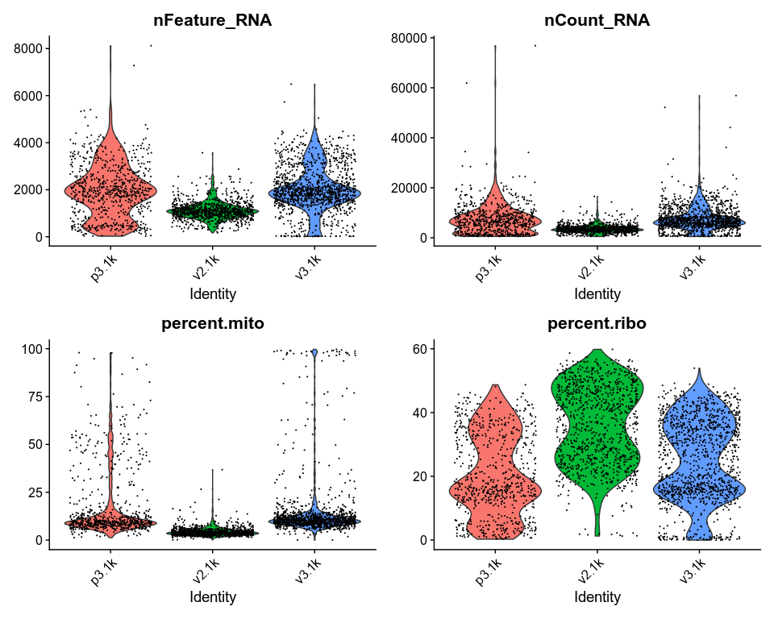<!-- -->

As you can see, the v2 chemistry gives lower gene detection, but higher
detection of ribosomal proteins. As the ribosomal proteins are highly
expressed they will make up a larger proportion of the transcriptional
landscape when fewer of the lowly expressed genes are detected.

We can also plot the different QC-measures as scatter plots.

``` r
p1 <- FeatureScatter(alldata, feature1 = "nCount_RNA", feature2 = "nFeature_RNA") + NoLegend()
p2 <- FeatureScatter(alldata, feature1 = "nFeature_RNA", feature2 = "percent.mito") + NoLegend()
p3 <- FeatureScatter(alldata, feature1="percent.ribo", feature2="nFeature_RNA")
p1 + p2 + p3
```

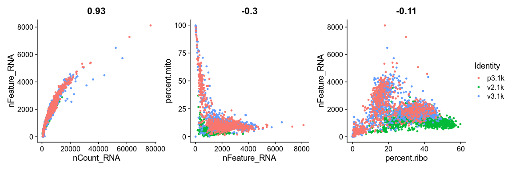<!-- -->

We can also subset the data to only plot one sample.

``` r
FeatureScatter(alldata, feature1 = "nCount_RNA", feature2 = "nFeature_RNA", 
               cells = WhichCells(alldata, expression = orig.ident == "v3.1k") )
```

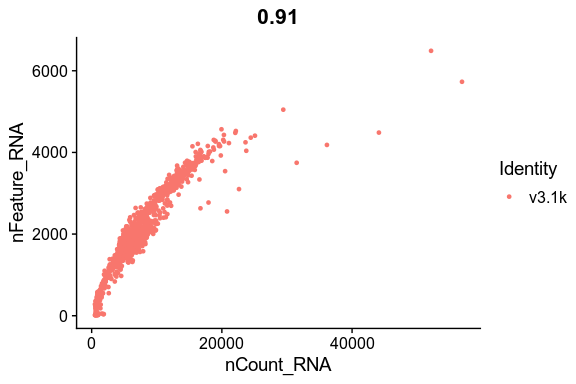<!-- -->

### Filtering

#### Mitochondrial filtering

We have quite a lot of cells with high proportion of mitochondrial
reads. It could be wise to remove those cells, if we have enough cells
left after filtering. Another option would be to either remove all
mitochondrial reads from the dataset and hope that the remaining genes
still have enough biological signal. A third option would be to just
regress out the `percent.mito` variable during scaling.

In this case we have as much as 99.7% mitochondrial reads in some of the
cells, so it is quite unlikely that there is much cell type signature
left in those.

By eyeballing the plots we can make reasonable decisions on where to
draw the cutoff. In this case, the bulk of the cells are below 25%
mitochondrial reads and that will be used as a cutoff.

``` r
# Select cells with percent.mito < 25
idx <- which(alldata$percent.mito < 25)
selected <- WhichCells(alldata, cells = idx)
length(selected)
```

    ## [1] 2703

``` r
# and subset the object to only keep those cells.
data.filt <- subset(alldata, cells = selected)
# plot violins for new data
VlnPlot(data.filt, features = "percent.mito")
```

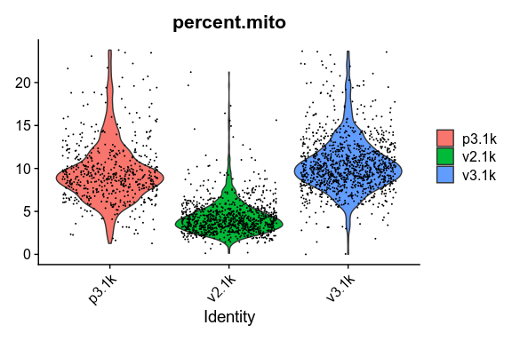<!-- -->

As you can see, there is still quite a lot of variation in percent mito,
so it will have to be dealt with in the data analysis step.

#### Gene detection filtering

Extremely high number of detected genes could indicate doublets.
However, depending on the cell type composition in your sample, you may
have cells with higher number of genes (and also higher counts) from one
cell type.

In our datasets, we observe a clear difference between the v2 vs v3 10x
chemistry with regards to gene detection, so it may not be fair to apply
the same cutoffs to all of them.

Also, in the protein assay data there is a lot of cells with few
detected genes giving a bimodal distribution. This type of distribution
is not seen in the other 2 datasets. Considering that they are all pbmc
datasets it makes sense to regard this distribution as low quality
libraries.

Filter the cells with high gene detection (putative doublets) with
cutoffs 4100 for v3 chemistry and 2000 for v2.

``` r
# Start with cells with many genes detected.
high.det.v3 <- WhichCells(data.filt, expression = nFeature_RNA > 4100)
high.det.v2 <- WhichCells(data.filt, expression = nFeature_RNA > 2000 & orig.ident == "v2.1k")
# Remove these cells.
data.filt <- subset(data.filt, cells=setdiff(WhichCells(data.filt),c(high.det.v2,high.det.v3)))
# Check number of cells.
ncol(data.filt)
```

    ## [1] 2631

Filter the cells with low gene detection (low quality libraries) with
less than 1000 genes for v2 and &lt; 500 for v2.

``` r
#start with cells with many genes detected.
low.det.v3 <- WhichCells(data.filt, expression = nFeature_RNA < 1000 & orig.ident != "v2.1k")
low.det.v2 <- WhichCells(data.filt, expression = nFeature_RNA < 500 & orig.ident == "v2.1k")
# remove these cells
data.filt <- subset(data.filt, cells=setdiff(WhichCells(data.filt),c(low.det.v2,low.det.v3)))
# check number of cells
ncol(data.filt)
```

    ## [1] 2531

#### Plot QC-stats again

Lets plot the same qc-stats another time.

``` r
VlnPlot(data.filt, features = c("nFeature_RNA", "nCount_RNA", "percent.mito", "percent.ribo"), 
        ncol = 2, pt.size = 0.1) + NoLegend()
```

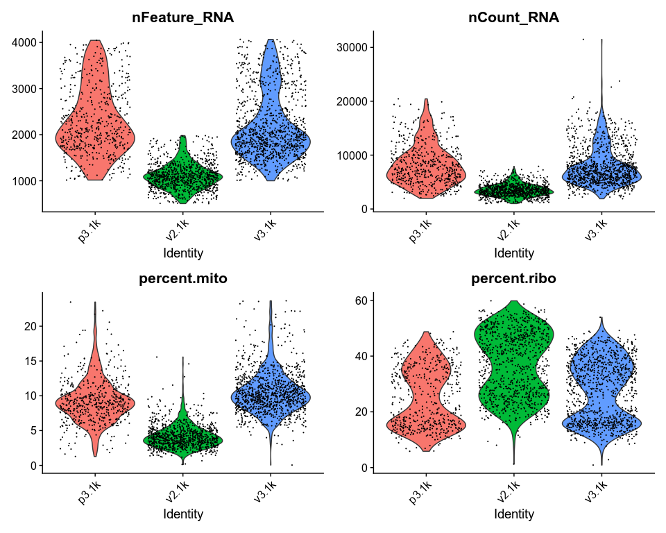<!-- -->

``` r
# and check the number of cells per sample before and after filtering
table(Idents(alldata))
```

    ## 
    ## p3.1k v2.1k v3.1k 
    ##   713   996  1222

``` r
table(Idents(data.filt))
```

    ## 
    ## p3.1k v2.1k v3.1k 
    ##   526   933  1072

### Calculate cell-cycle scores

Seurat has a function for calculating cell cycle scores based on a list
of know S-phase and G2/M-phase genes.

``` r
data.filt <- CellCycleScoring(
  object = data.filt,
  g2m.features = cc.genes$g2m.genes,
  s.features = cc.genes$s.genes
)
VlnPlot(data.filt, features = c("S.Score","G2M.Score"))
```

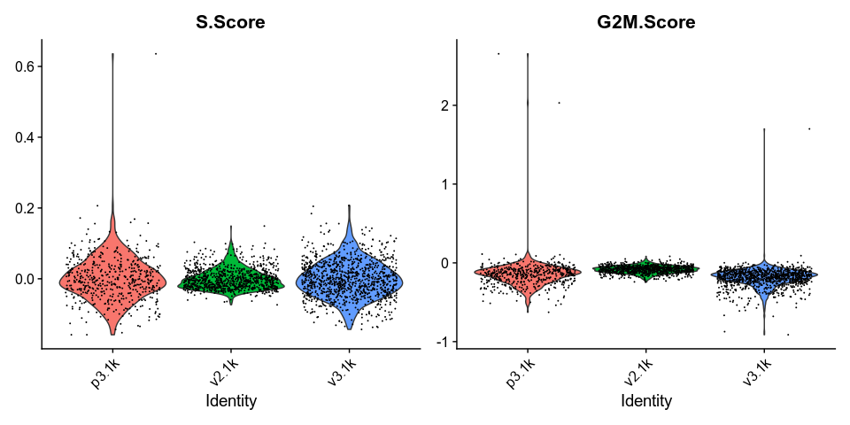<!-- -->

In this case it looks like we only have a few cycling cells in the
datasets.

## 2. Normalization

To speed things up, we will continue working with the v3.1k dataset
only. Furthermore, we will switch from working with Seurat to working
with the
[scater](https://bioconductor.org/packages/release/bioc/vignettes/scater/inst/doc/overview.html)
package. To do so we will convert the Seurat object to a
[`SingleCellExperiment`](https://bioconductor.org/packages/devel/bioc/vignettes/SingleCellExperiment/inst/doc/intro.html)
(SCE) object, and add some quality controls metrics to filter out low
quality cells as before.

``` r
pbmc.sce <- SingleCellExperiment(assays = list(counts = as.matrix(v3.1k)))
pbmc.sce <- addPerCellQC(pbmc.sce, subsets=list(MT=grepl("^MT-", rownames(pbmc.sce))))
#pbmc.sce <- addPerFeatureQC(pbmc.sce)
```

Similar to Seurat objects, SCE objects hold metadata for the cells and
features. We can access this data using `colData(pbmc.sce)` and
`rowData(pbmc.sce)` respectively. Take a look at what QC metrics have
been calculated for the cells:

``` r
head(colData(pbmc.sce))
```

    ## DataFrame with 6 rows and 6 columns
    ##                          sum  detected subsets_MT_sum subsets_MT_detected
    ##                    <numeric> <numeric>      <numeric>           <numeric>
    ## AAACCCAAGGAGAGTA-1      8288      2620            893                  11
    ## AAACGCTTCAGCCCAG-1      5512      1808            439                  13
    ## AAAGAACAGACGACTG-1      4283      1562            265                  11
    ## AAAGAACCAATGGCAG-1      2754      1225            165                  10
    ## AAAGAACGTCTGCAAT-1      6592      1831            436                  11
    ## AAAGGATAGTAGACAT-1      8845      2048            704                  11
    ##                    subsets_MT_percent     total
    ##                             <numeric> <numeric>
    ## AAACCCAAGGAGAGTA-1           10.77461      8288
    ## AAACGCTTCAGCCCAG-1            7.96444      5512
    ## AAAGAACAGACGACTG-1            6.18725      4283
    ## AAAGAACCAATGGCAG-1            5.99129      2754
    ## AAAGAACGTCTGCAAT-1            6.61408      6592
    ## AAAGGATAGTAGACAT-1            7.95930      8845

By default we get `sum`, the library size (sum of counts), and
`detected`, the number of features with non-zero counts. The column
`total` is only relevant if we wish to [subset the genes into distinct
groups that are processed
seperately](https://bioconductor.org/packages/devel/bioc/vignettes/SingleCellExperiment/inst/doc/intro.html#5_Adding_alternative_feature_sets),
which we will not do here. We find similar metrics for just the
mitochondrial genes in the `subsets_MT_*` columns as we have specified
them explicitly in the `subsets` parameter in the quality control call
above. Note that for subsets we get an additional `*_percent` column
indicating the percentage of counts that originate from that gene
subset.

We will use these metrics to filter out poor quality cells to avoid
negative size factors. These steps are very similar to what we have
already done on the combined Seurat object but now we perform them on
one dataset only using the scater package. We can subset SCE objects
using the square brackets syntax, as we would normally subset a data
frame or matrix in R.

``` r
pbmc.sce <- pbmc.sce[, pbmc.sce$subsets_MT_percent < 20]
pbmc.sce <- pbmc.sce[, (pbmc.sce$detected > 1000 & pbmc.sce$detected < 4100)]
```

Create a new assay with unnormalized counts for comparison to
post-normalization.

``` r
assay(pbmc.sce, "logcounts_raw") <- log2(counts(pbmc.sce) + 1)
plotRLE(pbmc.sce[,1:50], exprs_values = "logcounts_raw", style = "full")
```

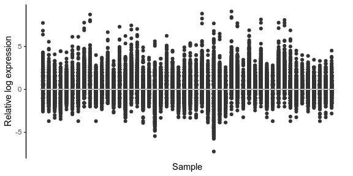<!-- -->

Run PCA and save the result in a new object, as we will overwrite the
PCA slot later. Also plot the expression of the B cell marker MS4A1.

``` r
raw.sce <- runPCA(pbmc.sce, exprs_values = "logcounts_raw")
p1 <- scater::plotPCA(raw.sce, colour_by = "total")
p2 <- plotReducedDim(raw.sce, dimred = "PCA", by_exprs_values = "logcounts_raw",
               colour_by = "MS4A1")
p1 + p2
```

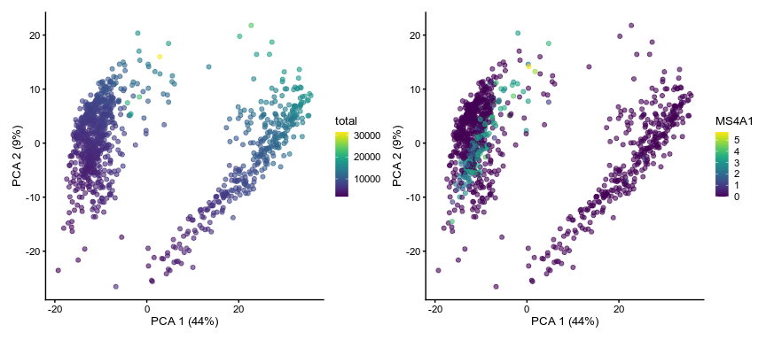<!-- -->

### Normalization: Log

In the default normalization method in Seurat, counts for each cell are
divided by the total counts for that cell and multiplied by the scale
factor 10,000. This is then log transformed.

Here we use the filtered data from the counts slot of the SCE object to
create a Seurat object. After normalization, we convert the result back
into a SingleCellExperiment object for comparing plots.

``` r
pbmc.seu <- CreateSeuratObject(counts(pbmc.sce), project = "PBMC")
pbmc.seu <- NormalizeData(pbmc.seu)
pbmc.seu.sce <- as.SingleCellExperiment(pbmc.seu)
pbmc.seu.sce <- addPerCellQC(pbmc.seu.sce)
```

Perform PCA and examine the normalization results with `plotRLE` and
`plotReducedDim`. This time, use `logcounts` as the expression values to
plot (or omit the parameter, as `logcounts` is the default value). Check
some marker genes, for example GNLY (NK cells) or LYZ (monocytes).

``` r
plotRLE(pbmc.seu.sce[,1:50], style = "full")
```

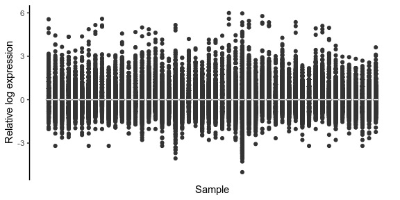<!-- -->

``` r
pbmc.seu.sce <- runPCA(pbmc.seu.sce)
p1 <- scater::plotPCA(pbmc.seu.sce, colour_by = "total")
p2 <- plotReducedDim(pbmc.seu.sce, dimred = "PCA", colour_by = "MS4A1")
p1 + p2
```

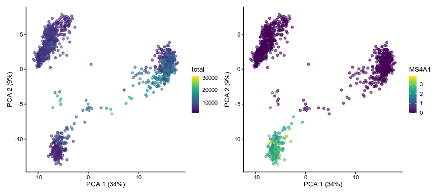<!-- -->

### Normalization: scran

The normalization procedure in scran is based on the deconvolution
method by Lun et al (2016). Counts from many cells are pooled to avoid
the drop-out problem. Pool-based size factors are then “deconvolved”
into cell-based factors for cell-specific normalization. Clustering
cells prior to normalization is not always necessary but it improves
normalization accuracy by reducing the number of DE genes between cells
in the same cluster.

We will apply this normalization procedure on the unnormalized
`pbmc.sce` object from before.

``` r
qclust <- scran::quickCluster(pbmc.sce)
pbmc.sce <- scran::computeSumFactors(pbmc.sce, clusters = qclust)
summary(sizeFactors(pbmc.sce))
```

    ##    Min. 1st Qu.  Median    Mean 3rd Qu.    Max. 
    ##  0.2942  0.6622  0.8338  1.0000  1.1697  2.7817

``` r
pbmc.sce <- logNormCounts(pbmc.sce)
```

Examine the results and compare to the log-normalized result. Are they
different?

``` r
plotRLE(pbmc.sce[,1:50], exprs_values = "logcounts", exprs_logged = FALSE, 
        style = "full")
```

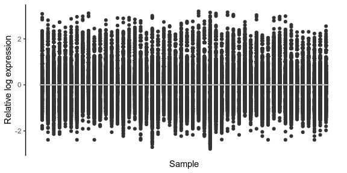<!-- -->

``` r
pbmc.sce <- runPCA(pbmc.sce)
p1 <- scater::plotPCA(pbmc.sce, colour_by = "total")
p2 <- plotReducedDim(pbmc.sce, dimred = "PCA", colour_by = "MS4A1")
p1 + p2
```

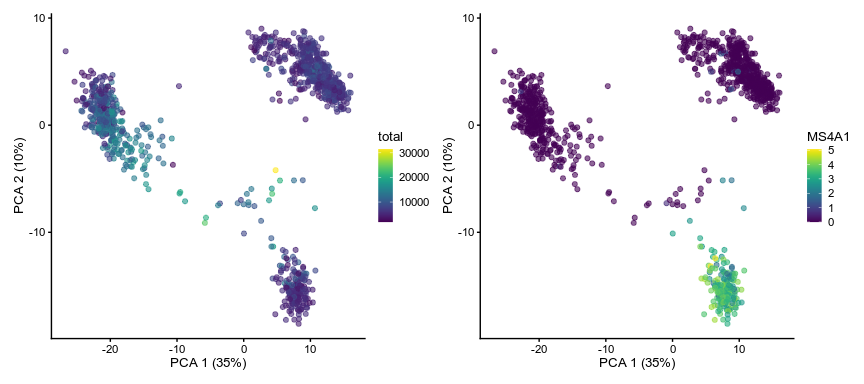<!-- -->

## 3. Feature selection

### Feature selection: scran

In the scran method for finding HVGs, a trend is first fitted to the
technical variances. In the absence of spike-ins, this is done using the
whole data, assuming that the majority of genes are not variably
expressed. Then, the biological component of the variance for each
endogenous gene is computed by subtracting the fitted value of the trend
from the total variance. HVGs are then identified as those genes with
the largest biological components. This avoids prioritizing genes that
are highly variable due to technical factors such as sampling noise
during RNA capture and library preparation. see the [scran
vignette](https://bioconductor.org/packages/devel/bioc/vignettes/scran/inst/doc/scran.html#5_variance_modelling)
for details.

``` r
dec <- modelGeneVar(pbmc.sce)
dec <- dec[!is.na(dec$FDR),]
top.hvgs <- order(dec$bio, decreasing = TRUE)
head(dec[top.hvgs,])
```

    ## DataFrame with 6 rows and 6 columns
    ##              mean     total      tech       bio      p.value          FDR
    ##         <numeric> <numeric> <numeric> <numeric>    <numeric>    <numeric>
    ## S100A9    2.19922  10.02030  0.803372   9.21693  0.00000e+00  0.00000e+00
    ## S100A8    1.96619   8.94515  0.816787   8.12836 1.14075e-256 6.86772e-253
    ## LYZ       2.14701   8.89947  0.806315   8.09316 4.62495e-261 4.17656e-257
    ## HLA-DRA   2.25676   5.46314  0.799185   4.66395  8.80854e-90  3.97727e-86
    ## CD74      2.83861   4.49007  0.761907   3.72817  9.16806e-64  2.75974e-60
    ## IGKC      1.00916   4.41372  0.721943   3.69178  1.92688e-69  6.96029e-66

``` r
dec$HVG <- (dec$FDR<0.00001)
hvg_genes <- rownames(dec[dec$FDR < 0.00001, ])
# plot highly variable genes
plot(dec$mean, dec$total, pch=16, cex=0.6, xlab="Mean log-expression",
     ylab="Variance of log-expression")
o <- order(dec$mean)
lines(dec$mean[o], dec$tech[o], col="dodgerblue", lwd=2)
points(dec$mean[dec$HVG], dec$total[dec$HVG], col="red", pch=16)
```

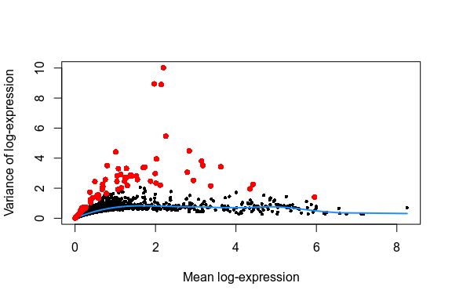<!-- -->

``` r
## save the decomposed variance table and hvg_genes into metadata for safekeeping
metadata(pbmc.sce)$hvg_genes <- hvg_genes
metadata(pbmc.sce)$dec_var <- dec
```

We choose genes that have a biological component that is significantly
greater than zero, using a false discovery rate (FDR) of 5%.

``` r
plotExpression(pbmc.sce, features = rownames(dec[top.hvgs[1:10],]))
```

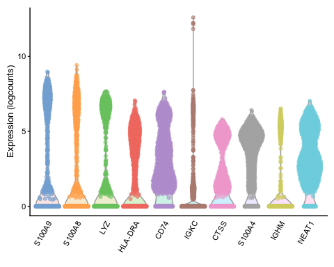<!-- -->

### Feature selection: Seurat

The default method in Seurat 3 is variance-stabilizing transformation. A
trend is fitted to to predict the variance of each gene as a function of
its mean. For each gene, the variance of standardized values is computed
across all cells and used to rank the features. By default, 2000 top
genes are returned.

``` r
pbmc.seu <- FindVariableFeatures(pbmc.seu, selection.method = "vst")
top10 <- head(VariableFeatures(pbmc.seu), 10)
vplot <- VariableFeaturePlot(pbmc.seu)
LabelPoints(plot = vplot, points = top10, repel = TRUE, xnudge = 0, ynudge = 0)
```

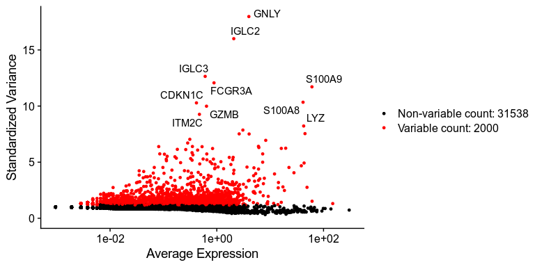<!-- -->

Seurat automatically stores the feature metrics in the metadata of the
assay.

``` r
head(pbmc.seu[["RNA"]][[]])
```

    ##                 vst.mean vst.variance vst.variance.expected
    ## MIR1302-2HG 0.0000000000 0.0000000000          0.0000000000
    ## FAM138A     0.0000000000 0.0000000000          0.0000000000
    ## OR4F5       0.0000000000 0.0000000000          0.0000000000
    ## AL627309.1  0.0056925996 0.0056655692          0.0062141702
    ## AL627309.3  0.0009487666 0.0009487666          0.0009485591
    ## AL627309.2  0.0000000000 0.0000000000          0.0000000000
    ##             vst.variance.standardized vst.variable
    ## MIR1302-2HG                 0.0000000        FALSE
    ## FAM138A                     0.0000000        FALSE
    ## OR4F5                       0.0000000        FALSE
    ## AL627309.1                  0.9117177        FALSE
    ## AL627309.3                  1.0002187        FALSE
    ## AL627309.2                  0.0000000        FALSE

How many of the variable genes detected with scran are included in
VariableFeatures in Seurat?

``` r
table(hvg_genes %in% VariableFeatures(pbmc.seu))
```

    ## 
    ## FALSE  TRUE 
    ##     5    71

## Saving the data

We will save the Seurat object for future analysis downstream.

``` r
saveRDS(pbmc.seu, file = "pbmc3k.rds")
```

## Session info

``` r
sessionInfo()
```

    ## R version 4.1.1 (2021-08-10)
    ## Platform: x86_64-conda-linux-gnu (64-bit)
    ## Running under: KDE neon User Edition 5.22
    ## 
    ## Matrix products: default
    ## BLAS/LAPACK: /home/mochar/miniconda3/envs/sc_course/lib/libopenblasp-r0.3.17.so
    ## 
    ## locale:
    ##  [1] LC_CTYPE=nl_NL.UTF-8       LC_NUMERIC=C              
    ##  [3] LC_TIME=nl_NL.UTF-8        LC_COLLATE=nl_NL.UTF-8    
    ##  [5] LC_MONETARY=nl_NL.UTF-8    LC_MESSAGES=nl_NL.UTF-8   
    ##  [7] LC_PAPER=nl_NL.UTF-8       LC_NAME=C                 
    ##  [9] LC_ADDRESS=C               LC_TELEPHONE=C            
    ## [11] LC_MEASUREMENT=nl_NL.UTF-8 LC_IDENTIFICATION=C       
    ## 
    ## attached base packages:
    ## [1] parallel  stats4    stats     graphics  grDevices utils     datasets 
    ## [8] methods   base     
    ## 
    ## other attached packages:
    ##  [1] Matrix_1.3-4                scran_1.20.1               
    ##  [3] scater_1.20.1               ggplot2_3.3.5              
    ##  [5] scuttle_1.2.1               SingleCellExperiment_1.14.1
    ##  [7] SummarizedExperiment_1.22.0 Biobase_2.52.0             
    ##  [9] GenomicRanges_1.44.0        GenomeInfoDb_1.28.4        
    ## [11] IRanges_2.26.0              S4Vectors_0.30.0           
    ## [13] BiocGenerics_0.38.0         MatrixGenerics_1.4.3       
    ## [15] matrixStats_0.61.0          SeuratObject_4.0.2         
    ## [17] Seurat_4.0.4               
    ## 
    ## loaded via a namespace (and not attached):
    ##   [1] plyr_1.8.6                igraph_1.2.6             
    ##   [3] lazyeval_0.2.2            splines_4.1.1            
    ##   [5] BiocParallel_1.26.2       listenv_0.8.0            
    ##   [7] scattermore_0.7           digest_0.6.27            
    ##   [9] htmltools_0.5.2           viridis_0.6.1            
    ##  [11] fansi_0.5.0               magrittr_2.0.1           
    ##  [13] ScaledMatrix_1.0.0        tensor_1.5               
    ##  [15] cluster_2.1.2             ROCR_1.0-11              
    ##  [17] limma_3.48.3              globals_0.14.0           
    ##  [19] spatstat.sparse_2.0-0     colorspace_2.0-2         
    ##  [21] ggrepel_0.9.1             xfun_0.26                
    ##  [23] dplyr_1.0.7               crayon_1.4.1             
    ##  [25] RCurl_1.98-1.5            jsonlite_1.7.2           
    ##  [27] spatstat.data_2.1-0       survival_3.2-13          
    ##  [29] zoo_1.8-9                 glue_1.4.2               
    ##  [31] polyclip_1.10-0           gtable_0.3.0             
    ##  [33] zlibbioc_1.38.0           XVector_0.32.0           
    ##  [35] leiden_0.3.9              DelayedArray_0.18.0      
    ##  [37] BiocSingular_1.8.1        future.apply_1.8.1       
    ##  [39] abind_1.4-5               scales_1.1.1             
    ##  [41] edgeR_3.34.1              miniUI_0.1.1.1           
    ##  [43] Rcpp_1.0.7                viridisLite_0.4.0        
    ##  [45] xtable_1.8-4              dqrng_0.3.0              
    ##  [47] reticulate_1.22           spatstat.core_2.3-0      
    ##  [49] bit_4.0.4                 rsvd_1.0.5               
    ##  [51] metapod_1.0.0             htmlwidgets_1.5.4        
    ##  [53] httr_1.4.2                RColorBrewer_1.1-2       
    ##  [55] ellipsis_0.3.2            ica_1.0-2                
    ##  [57] farver_2.1.0              pkgconfig_2.0.3          
    ##  [59] uwot_0.1.10               deldir_0.2-10            
    ##  [61] locfit_1.5-9.4            utf8_1.2.2               
    ##  [63] labeling_0.4.2            tidyselect_1.1.1         
    ##  [65] rlang_0.4.11              reshape2_1.4.4           
    ##  [67] later_1.3.0               munsell_0.5.0            
    ##  [69] tools_4.1.1               generics_0.1.0           
    ##  [71] ggridges_0.5.3            evaluate_0.14            
    ##  [73] stringr_1.4.0             fastmap_1.1.0            
    ##  [75] yaml_2.2.1                goftest_1.2-2            
    ##  [77] bit64_4.0.5               knitr_1.34               
    ##  [79] fitdistrplus_1.1-5        purrr_0.3.4              
    ##  [81] RANN_2.6.1                pbapply_1.5-0            
    ##  [83] future_1.22.1             nlme_3.1-153             
    ##  [85] sparseMatrixStats_1.4.2   mime_0.11                
    ##  [87] hdf5r_1.3.4               compiler_4.1.1           
    ##  [89] beeswarm_0.4.0            plotly_4.9.4.1           
    ##  [91] png_0.1-7                 spatstat.utils_2.2-0     
    ##  [93] statmod_1.4.36            tibble_3.1.4             
    ##  [95] stringi_1.7.4             highr_0.9                
    ##  [97] bluster_1.2.1             lattice_0.20-44          
    ##  [99] vctrs_0.3.8               pillar_1.6.2             
    ## [101] lifecycle_1.0.0           spatstat.geom_2.2-2      
    ## [103] lmtest_0.9-38             RcppAnnoy_0.0.19         
    ## [105] BiocNeighbors_1.10.0      data.table_1.14.0        
    ## [107] cowplot_1.1.1             bitops_1.0-7             
    ## [109] irlba_2.3.3               httpuv_1.6.3             
    ## [111] patchwork_1.1.1           R6_2.5.1                 
    ## [113] promises_1.2.0.1          KernSmooth_2.23-20       
    ## [115] gridExtra_2.3             vipor_0.4.5              
    ## [117] parallelly_1.28.1         codetools_0.2-18         
    ## [119] MASS_7.3-54               withr_2.4.2              
    ## [121] sctransform_0.3.2         GenomeInfoDbData_1.2.6   
    ## [123] mgcv_1.8-36               grid_4.1.1               
    ## [125] rpart_4.1-15              beachmat_2.8.1           
    ## [127] tidyr_1.1.3               rmarkdown_2.11           
    ## [129] DelayedMatrixStats_1.14.3 Rtsne_0.15               
    ## [131] shiny_1.6.0               ggbeeswarm_0.6.0
