Trajectory inference
================
Jules GILET (Institut Curie, France)

Created by: Jules GILET (Institut Curie, France)  
Edited by: Mohammed Charrout, Lieke Michielsen

# Overview

Transcriptional trajectories will be inferred from data by Nestorowa,
Hamey et al. ([Blood,
2016](https://www.ncbi.nlm.nih.gov/pmc/articles/PMC5305050/)) The
dataset consists of 1600 hematopoietic stem and progenitor cells from
mouse bone marrow, sequenced using the SMARTseq2 technology. Using flow
cytometry and index sorting, 12 HSPC of different phenotypes (about 10
cells each) have been included in the dataset, and will be used in this
lab as a biological prior for the identification of the root and the
branches in the transcriptional trajectory models.

## Datasets

You can find the datasets within `data.zip` in this directory. Unpack
it, and make sure that it creates a seperate directory named `data` that
includes the following files:

-   nestorowa\_corrected\_log2\_transformed\_counts.txt
-   nestorowa\_corrected\_population\_annotation.txt
-   HTSeq\_counts.txt

## Part I - Monocle2/DDRtree

Inference is done with Monocle2/DDRtree available via Bioconductor.

``` r
library(monocle)
library(biomaRt)
```

### Data loading

The authors provide an expression matrix that has been filtered (highly
expressed genes, high quality cells), scaled and log-normalized. An
annotation table is also provided, with each cell type labelled
according to the immunophenotyping done by flow cytometry.

``` r
lognorm <- t(read.table('data/nestorowa_corrected_log2_transformed_counts.txt', sep=" ", header=TRUE))
anno_table <- read.table('data/nestorowa_corrected_population_annotation.txt')
```

To infer a trajectory with Monocle2/DDRtree, using non-normalized
UMI-based counts is highly recommended, as Monocle2 will scale and
normalize the data internally and is expecting data distributed
according to a negative binomial.

The count matrix has been downloaded and will be used for Monocle2:

``` r
counts <- read.table('data/HTSeq_counts.txt', sep="\t", header=TRUE, row.names='ID')

counts[1:5,1:5]
```

    ##                    HSPC_007 HSPC_013 HSPC_019 HSPC_025 HSPC_031
    ## ENSMUSG00000000001        0        7        1      185        2
    ## ENSMUSG00000000003        0        0        0        0        0
    ## ENSMUSG00000000028        4        1        2        4        3
    ## ENSMUSG00000000031        0        0        0        0        0
    ## ENSMUSG00000000037        0        0        0        0        0

``` r
dim(counts)
```

    ## [1] 46175  1920

``` r
lognorm[1:5,1:5]
```

    ##                HSPC_001 HSPC_002 HSPC_003 HSPC_004 HSPC_006
    ## X1110032F04Rik 0.000000 0.000000 0.000000 0.000000 0.000000
    ## X1110059E24Rik 0.000000 0.000000 2.795189 1.326478 7.348663
    ## X1300017J02Rik 0.000000 0.000000 0.000000 0.000000 0.000000
    ## X1600014C10Rik 0.000000 2.238601 0.000000 1.326478 4.946766
    ## X1700017B05Rik 1.225439 2.238601 1.989360 2.005685 0.000000

``` r
dim(lognorm)
```

    ## [1] 3991 1645

Note that the count matrix is not filtered, and genes are labelled
according to ensembl gene IDs. We will first filter the matrix according
to the authors choices (ie. we keep the cells and genes present in the
lognorm matrix) and we will map the gene official symbols.

We filter the counts to keep only high quality cells:

``` r
counts <- counts[ , colnames(lognorm) ]
dim(counts)
```

    ## [1] 46175  1645

We create an annotation data frame to label the cell types as defined by
the authors:

``` r
pDat <- data.frame(cell=colnames(counts), celltype='undefined', stringsAsFactors=FALSE)
rownames(pDat) <- pDat$cell
pDat[ rownames(anno_table), 2] <- as.character(anno_table$celltype)
head(pDat)
```

    ##              cell  celltype
    ## HSPC_001 HSPC_001 undefined
    ## HSPC_002 HSPC_002 undefined
    ## HSPC_003 HSPC_003 undefined
    ## HSPC_004 HSPC_004 undefined
    ## HSPC_006 HSPC_006 undefined
    ## HSPC_008 HSPC_008 undefined

We create a feature annotation data frame that will contain gene
informations and matching symbols and IDs. The genes IDs in the counts
matrix are annotated using the biomaRt Bioconductor package:

``` r
mart <- biomaRt::useDataset("mmusculus_gene_ensembl", biomaRt::useMart("ensembl"))
genes_table <- biomaRt::getBM(attributes=c("ensembl_gene_id", "external_gene_name"), values=rownames(counts), mart=mart)
rownames(genes_table) <- genes_table$ensembl_gene_id
head(genes_table)
```

    ##                       ensembl_gene_id external_gene_name
    ## ENSMUSG00000064336 ENSMUSG00000064336              mt-Tf
    ## ENSMUSG00000064337 ENSMUSG00000064337            mt-Rnr1
    ## ENSMUSG00000064338 ENSMUSG00000064338              mt-Tv
    ## ENSMUSG00000064339 ENSMUSG00000064339            mt-Rnr2
    ## ENSMUSG00000064340 ENSMUSG00000064340             mt-Tl1
    ## ENSMUSG00000064341 ENSMUSG00000064341             mt-Nd1

``` r
fDat <- genes_table[ rownames(counts), ]
# to be consistent with Monocle naming conventions
colnames(fDat) <- c('ensembl_gene_id', 'gene_short_name')
head(fDat)
```

    ##                       ensembl_gene_id gene_short_name
    ## ENSMUSG00000000001 ENSMUSG00000000001           Gnai3
    ## ENSMUSG00000000003 ENSMUSG00000000003            Pbsn
    ## ENSMUSG00000000028 ENSMUSG00000000028           Cdc45
    ## ENSMUSG00000000031 ENSMUSG00000000031             H19
    ## ENSMUSG00000000037 ENSMUSG00000000037           Scml2
    ## ENSMUSG00000000049 ENSMUSG00000000049            Apoh

We can now use this table to filter the genes in the counts matrix that
are highly expressed according to the quality filters used by the
authors:

``` r
fDat <- fDat[fDat$gene_short_name %in% rownames(lognorm), ]
```

And we finally keep in the counts matrix only these genes:

``` r
counts <- counts[ rownames(fDat), ]
dim(counts)
```

    ## [1] 3761 1645

``` r
dim(fDat)
```

    ## [1] 3761    2

``` r
dim(pDat)
```

    ## [1] 1645    2

We build a cell dataset object in an appropriate format for Monocle.
Default method for modeling the expression values is
`VGAM::negbinomial.size()` and is adapted to counts.

``` r
cds <- newCellDataSet(as.matrix(counts), phenoData=Biobase::AnnotatedDataFrame(pDat), featureData=Biobase::AnnotatedDataFrame(fDat))
cds
```

    ## CellDataSet (storageMode: environment)
    ## assayData: 3761 features, 1645 samples 
    ##   element names: exprs 
    ## protocolData: none
    ## phenoData
    ##   sampleNames: HSPC_001 HSPC_002 ... Prog_852 (1645 total)
    ##   varLabels: cell celltype Size_Factor
    ##   varMetadata: labelDescription
    ## featureData
    ##   featureNames: ENSMUSG00000000001 ENSMUSG00000000028 ...
    ##     ENSMUSG00000105504 (3761 total)
    ##   fvarLabels: ensembl_gene_id gene_short_name
    ##   fvarMetadata: labelDescription
    ## experimentData: use 'experimentData(object)'
    ## Annotation:

#### Trajectory inference

The monocle cds object is built and ready for trajectory inference.

``` r
dir.create('monocle', showWarnings=FALSE)
saveRDS(cds, 'monocle/cds_hematopoiesis.rds')

# Monocle2 preprocess
# normalization and scaling
cds <- estimateSizeFactors(cds)
cds <- estimateDispersions(cds)
```

We find the genes that are expressed by applying a filter based on a
minimum expression threshold.

``` r
cds <- detectGenes(cds, min_expr=0.1)
print(head(fData(cds)))
```

    ##                       ensembl_gene_id gene_short_name num_cells_expressed
    ## ENSMUSG00000000001 ENSMUSG00000000001           Gnai3                1613
    ## ENSMUSG00000000028 ENSMUSG00000000028           Cdc45                1438
    ## ENSMUSG00000000056 ENSMUSG00000000056            Narf                1333
    ## ENSMUSG00000000058 ENSMUSG00000000058            Cav2                 577
    ## ENSMUSG00000000078 ENSMUSG00000000078            Klf6                1560
    ## ENSMUSG00000000127 ENSMUSG00000000127             Fer                 578

We then identify genes that are expressed in at least 10 cells.

``` r
expressed_genes <- row.names(subset(fData(cds), num_cells_expressed >= 10))
length(expressed_genes)
```

    ## [1] 3760

Identification of the ordering genes by differential testing (likelihood
ratio test) i.e. genes that are presumed to be important in the
differentiation process captured in the sample. We used the cell types
identified by the authors to define the ordering genes by DE testing.
(Alternatively, a classical approach consist of clustering the cells,
then identify markers genes per clusters.)

``` r
diff_test_res <- differentialGeneTest(cds[ expressed_genes, ], fullModelFormulaStr="~ celltype")
ordering_genes <- row.names(subset(diff_test_res, qval < 0.01))
length(ordering_genes)
```

    ## [1] 678

We mark the genes that will be used for the ordering :

``` r
cds <- setOrderingFilter(cds, ordering_genes)
```

We use the DDRTree algorithm to infer a trajectory with potential
branching points.

``` r
cds <- reduceDimension(cds, max_components = 2, method='DDRTree')
cds <- orderCells(cds)
plot_cell_trajectory(cds, color_by="celltype")
```

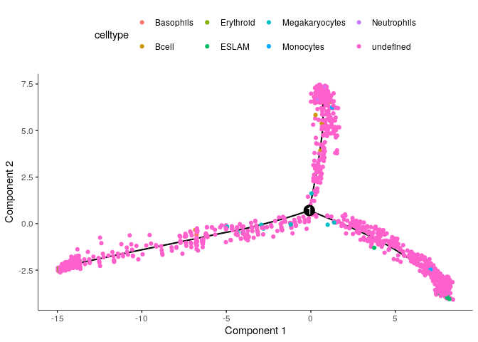<!-- -->

``` r
# Changing the cell color 
cell_colors <-  c('lightblue','blue','red','black','orange','yellow','turquoise','lightgrey')
plot_cell_trajectory(cds, color_by="celltype") + scale_color_manual(values=cell_colors)
```

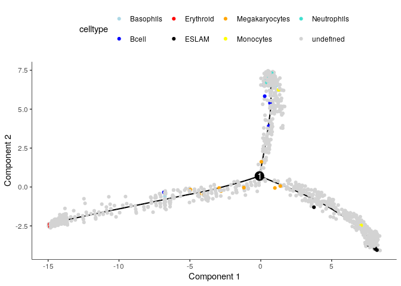<!-- -->

The most immature HSCs in the sample express E-Slam. We will define the
root of this model according to this subset of cells:

``` r
table(pData(cds)$State, pData(cds)$celltype)[,"ESLAM"]
```

    ##  1  2  3 
    ## 10  0  0

State 1 defines the root in the model as it contains all 10 of the
E-Slam-expressing cells. Note that Monocle might return a different
state number containing these cells. Simply pass the correct state
number to the `orderCells` function:

``` r
cds <- orderCells(cds, root_state = 1)
```

The pseudotime is now defined by the distance to the root:

``` r
plot_cell_trajectory(cds, color_by = "Pseudotime")
```

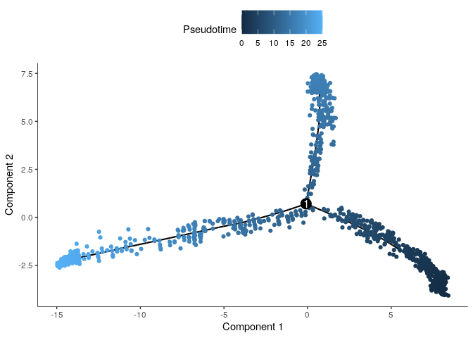<!-- -->

#### Differential expression testing per branch

This time we look at the genes that are differentially expressed
according to the pseudotime model.

``` r
diff_test_res <- differentialGeneTest(cds[ ordering_genes, ], fullModelFormulaStr = "~sm.ns(Pseudotime)")
sig_gene_names <- row.names(subset(diff_test_res, qval < 0.1))
plot_pseudotime_heatmap(cds[ sig_gene_names[1:50], ], num_clusters = 3, cores=4, show_rownames=TRUE)
```

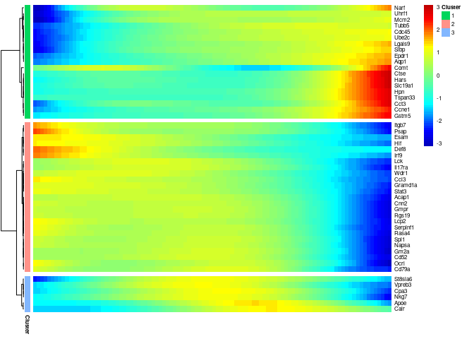<!-- -->

Differential expression per branch is done with a specific test:
Branched expression analysis modeling (BEAM). The test compares two
models with a likelihood ratio test for branch-dependent expression. The
full model is the product of smooth Pseudotime and the Branch a cell is
assigned to. The reduced model just includes Pseudotime. We look for
genes involved in the erythroid pathway

``` r
BEAM_res <- BEAM(cds, branch_point = 1, cores = 4)
```

``` r
BEAM_res <- BEAM_res[order(BEAM_res$qval),]
BEAM_res <- BEAM_res[,c("gene_short_name", "pval", "qval")]
head(BEAM_res)
```

    ##                    gene_short_name pval qval
    ## ENSMUSG00000004552            Ctse    0    0
    ## ENSMUSG00000004655            Aqp1    0    0
    ## ENSMUSG00000009350             Mpo    0    0
    ## ENSMUSG00000016494            Cd34    0    0
    ## ENSMUSG00000018819            Lsp1    0    0
    ## ENSMUSG00000020125           Elane    0    0

``` r
plot_genes_branched_heatmap(cds[row.names(BEAM_res)[1:50]], branch_point = 1, num_clusters = 3, cores=4, use_gene_short_name=TRUE, show_rownames=TRUE)
```

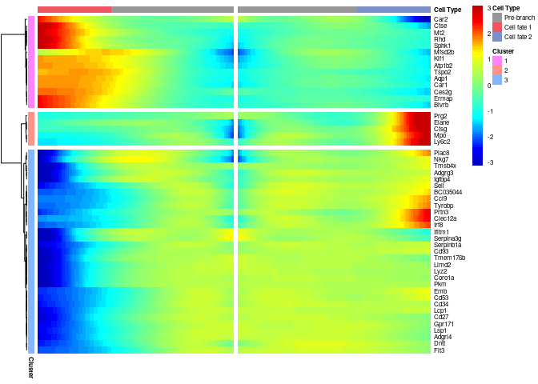<!-- -->

There is a clear separation between genes that are involved in the
erythroid differentiation (eg. Gata1) on the left (cell fate1) with
genes involved in the leukocyte differentiation (eg. Sell, Ccl9).

``` r
plot_genes_branched_pseudotime(cds[row.names(BEAM_res)[1:5]], branch_point = 1, color_by = "celltype", ncol = 1)  + scale_color_manual(values=cell_colors)
```

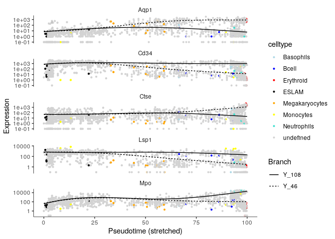<!-- -->

## Part II - Diffusion map

``` r
# Analysis and inference done with the destiny package available via Bioconductor

# Trajectory inference by diffusion map an diffusion pseudotime

library(destiny)
library(ggplot2)
library(gridExtra)
```

#### Data loading

We now will directly use the filtered, scaled, log-normalised expression
matrix provided by the authors of the article.

``` r
lognorm <- t(read.table('data/nestorowa_corrected_log2_transformed_counts.txt', sep=" ", header=TRUE))
lognorm[1:5,1:5]
```

    ##                HSPC_001 HSPC_002 HSPC_003 HSPC_004 HSPC_006
    ## X1110032F04Rik 0.000000 0.000000 0.000000 0.000000 0.000000
    ## X1110059E24Rik 0.000000 0.000000 2.795189 1.326478 7.348663
    ## X1300017J02Rik 0.000000 0.000000 0.000000 0.000000 0.000000
    ## X1600014C10Rik 0.000000 2.238601 0.000000 1.326478 4.946766
    ## X1700017B05Rik 1.225439 2.238601 1.989360 2.005685 0.000000

We load the annotation of cell types that has been defined using flow
cytometry and index sorting. The cell subsets (final differentiation
stages) will be used to validate the trajectory model.

``` r
anno_table <- read.table('data/nestorowa_corrected_population_annotation.txt')
pDat <- data.frame(cell=colnames(lognorm), celltype='undefined', stringsAsFactors=FALSE)
rownames(pDat) <- pDat$cell
pDat[ rownames(anno_table), 2] <- as.character(anno_table$celltype)
```

We build an expression set object for an easier integration with
destiny:

``` r
eset <- Biobase::ExpressionSet(lognorm, phenoData=Biobase::AnnotatedDataFrame(pDat))
eset
```

    ## ExpressionSet (storageMode: lockedEnvironment)
    ## assayData: 3991 features, 1645 samples 
    ##   element names: exprs 
    ## protocolData: none
    ## phenoData
    ##   sampleNames: HSPC_001 HSPC_002 ... Prog_852 (1645 total)
    ##   varLabels: cell celltype
    ##   varMetadata: labelDescription
    ## featureData: none
    ## experimentData: use 'experimentData(object)'
    ## Annotation:

The expression set is ready for inference with destiny:

``` r
dir.create('destiny', showWarnings=FALSE)
saveRDS(eset, 'destiny/eset_hematopoiesis.rds')
```

``` r
# The process takes less than 60 seconds
dmap <- DiffusionMap(eset)

# We look at the global model
plot.DiffusionMap(dmap)
```

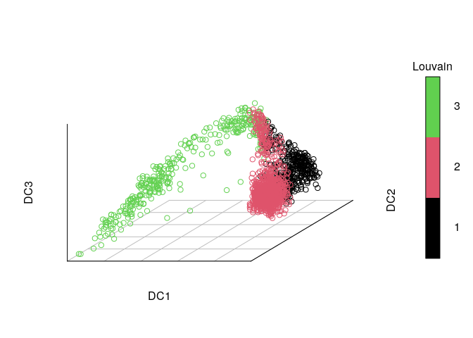<!-- -->

``` r
p1 <- plot.DiffusionMap(dmap, dims=c(1,2)) 
p2 <- plot.DiffusionMap(dmap, dims=c(2,3))
p3 <- plot.DiffusionMap(dmap, dims=c(1,3))
grid.arrange(p1, p2, p3, nrow = 1)
```

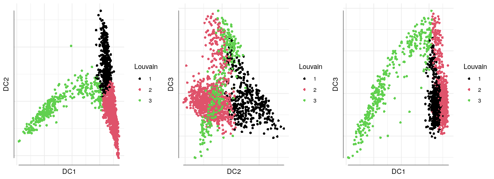<!-- -->

Components 1-2 describe well the branching process between erythroid
(red) and myeloid/lymphoid (white) lineages.

We use ggplot2 to have a better rendering and project the cell labels as
defined by flow cytometry experiment and index sorting.

``` r
qplot(DC1, DC2, data=as.data.frame(dmap), colour=celltype) + 
  scale_color_manual(values=c('lightblue','brown','red','black','orange','yellow','blue','lightgrey')) + 
  theme(panel.grid.major = element_blank(), 
        panel.grid.minor = element_blank(), 
        panel.background = element_blank(), 
        axis.line = element_line(colour = "black"))
```

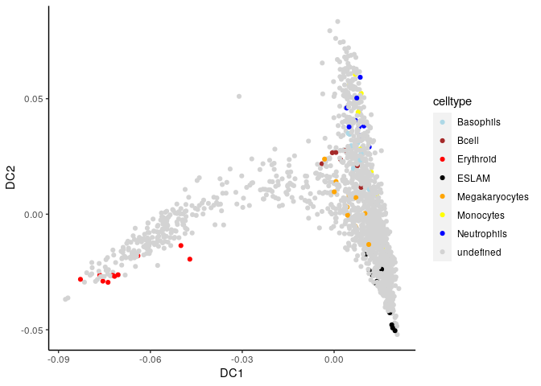<!-- -->

#### Pseudotime inference by diffusion

The transcriptional distance between cells is estimated by random walk
along a neighborhood graph. The resulting “transcriptional” transition
probability between cells is used to infer a pseudo-time scale of the
differentiation process.

We first define a root cell (origin) for the model. We find the index of
a ESLAM positive cells:

``` r
which(anno_table$celltype=="ESLAM")
```

    ##  [1] 19 20 21 22 23 24 25 26 27 28

We use this cell as a starting point

``` r
dpt <- DPT(dmap, tips=19)
plot(dpt)
```

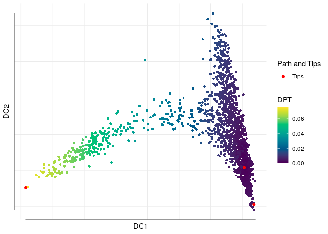<!-- -->

We can project the level of expression of known marker genes on the
trajectory model. Procr / Endothelial protein C is a marker of HSC
subsets:

``` r
plot(dpt, col_by='Procr', pal=viridis::magma)
```

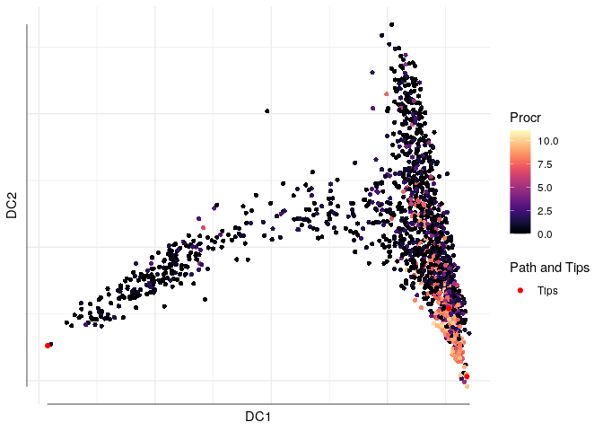<!-- -->

Gata1 is a key TF of the erythroid lineage

``` r
plot(dpt, col_by='Gata1', pal=viridis::magma)
```

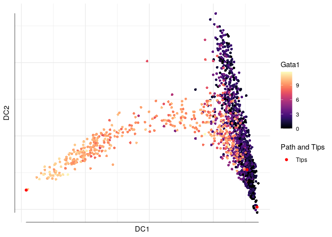<!-- -->

Cathepsin G is a marker of neutrophils

``` r
plot(dpt, col_by='Ctsg', pal=viridis::magma)
```

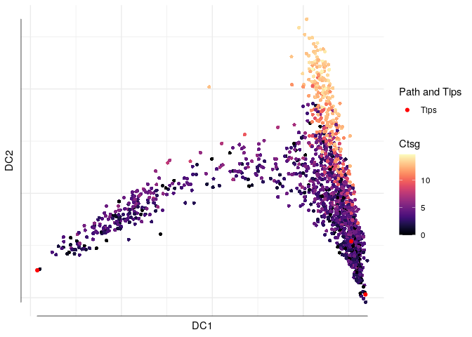<!-- -->

``` r
sessionInfo()
```

    ## R version 4.0.0 (2020-04-24)
    ## Platform: x86_64-conda_cos6-linux-gnu (64-bit)
    ## Running under: KDE neon User - Plasma 25th Anniversary Edition
    ## 
    ## Matrix products: default
    ## BLAS/LAPACK: /home/mochar/miniconda3/envs/destiny/lib/libopenblasp-r0.3.12.so
    ## 
    ## locale:
    ##  [1] LC_CTYPE=nl_NL.UTF-8       LC_NUMERIC=C              
    ##  [3] LC_TIME=nl_NL.UTF-8        LC_COLLATE=nl_NL.UTF-8    
    ##  [5] LC_MONETARY=nl_NL.UTF-8    LC_MESSAGES=nl_NL.UTF-8   
    ##  [7] LC_PAPER=nl_NL.UTF-8       LC_NAME=C                 
    ##  [9] LC_ADDRESS=C               LC_TELEPHONE=C            
    ## [11] LC_MEASUREMENT=nl_NL.UTF-8 LC_IDENTIFICATION=C       
    ## 
    ## attached base packages:
    ##  [1] splines   stats4    parallel  stats     graphics  grDevices utils    
    ##  [8] datasets  methods   base     
    ## 
    ## other attached packages:
    ##  [1] gridExtra_2.3       destiny_3.4.0       biomaRt_2.46.3     
    ##  [4] monocle_2.18.0      DDRTree_0.1.5       irlba_2.3.3        
    ##  [7] VGAM_1.1-5          ggplot2_3.3.5       Biobase_2.50.0     
    ## [10] BiocGenerics_0.36.1 Matrix_1.3-4       
    ## 
    ## loaded via a namespace (and not attached):
    ##   [1] readxl_1.3.1                BiocFileCache_1.14.0       
    ##   [3] RcppEigen_0.3.3.9.1         plyr_1.8.6                 
    ##   [5] igraph_1.2.6                sp_1.4-5                   
    ##   [7] RcppHNSW_0.3.0              densityClust_0.3           
    ##   [9] GenomeInfoDb_1.26.7         fastICA_1.2-3              
    ##  [11] digest_0.6.28               htmltools_0.5.2            
    ##  [13] viridis_0.6.1               fansi_0.5.0                
    ##  [15] magrittr_2.0.1              memoise_2.0.0              
    ##  [17] cluster_2.1.0               openxlsx_4.2.4             
    ##  [19] limma_3.46.0                matrixStats_0.61.0         
    ##  [21] docopt_0.7.1                xts_0.12.1                 
    ##  [23] askpass_1.1                 prettyunits_1.1.1          
    ##  [25] colorspace_2.0-2            blob_1.2.2                 
    ##  [27] rappdirs_0.3.3              ggrepel_0.9.1              
    ##  [29] haven_2.4.3                 xfun_0.26                  
    ##  [31] dplyr_1.0.7                 sparsesvd_0.2              
    ##  [33] crayon_1.4.1                RCurl_1.98-1.5             
    ##  [35] hexbin_1.28.1               zoo_1.8-9                  
    ##  [37] glue_1.4.2                  gtable_0.3.0               
    ##  [39] zlibbioc_1.36.0             XVector_0.30.0             
    ##  [41] DelayedArray_0.16.3         car_3.0-11                 
    ##  [43] SingleCellExperiment_1.12.0 DEoptimR_1.0-9             
    ##  [45] abind_1.4-5                 VIM_6.1.1                  
    ##  [47] scales_1.1.1                ggplot.multistats_1.0.0    
    ##  [49] pheatmap_1.0.12             DBI_1.1.1                  
    ##  [51] ggthemes_4.2.4              Rcpp_1.0.7                 
    ##  [53] viridisLite_0.4.0           progress_1.2.2             
    ##  [55] laeken_0.5.2                foreign_0.8-81             
    ##  [57] bit_4.0.4                   proxy_0.4-26               
    ##  [59] vcd_1.4-8                   httr_1.4.2                 
    ##  [61] FNN_1.1.3                   RColorBrewer_1.1-2         
    ##  [63] ellipsis_0.3.2              pkgconfig_2.0.3            
    ##  [65] XML_3.99-0.8                farver_2.1.0               
    ##  [67] nnet_7.3-16                 dbplyr_2.1.1               
    ##  [69] utf8_1.2.2                  tidyselect_1.1.1           
    ##  [71] labeling_0.4.2              rlang_0.4.11               
    ##  [73] reshape2_1.4.4              AnnotationDbi_1.52.0       
    ##  [75] munsell_0.5.0               cellranger_1.1.0           
    ##  [77] tools_4.0.0                 cachem_1.0.6               
    ##  [79] generics_0.1.0              RSQLite_2.2.8              
    ##  [81] ranger_0.13.1               evaluate_0.14              
    ##  [83] stringr_1.4.0               fastmap_1.1.0              
    ##  [85] yaml_2.2.1                  knitr_1.36                 
    ##  [87] bit64_4.0.5                 zip_2.2.0                  
    ##  [89] robustbase_0.93-9           purrr_0.3.4                
    ##  [91] RANN_2.6.1                  slam_0.1-48                
    ##  [93] xml2_1.3.2                  compiler_4.0.0             
    ##  [95] curl_4.3.2                  e1071_1.7-9                
    ##  [97] knn.covertree_1.0           smoother_1.1               
    ##  [99] tibble_3.1.5                stringi_1.4.6              
    ## [101] highr_0.9                   RSpectra_0.16-0            
    ## [103] forcats_0.5.1               lattice_0.20-45            
    ## [105] HSMMSingleCell_1.10.0       vctrs_0.3.8                
    ## [107] pillar_1.6.3                lifecycle_1.0.1            
    ## [109] combinat_0.0-8              lmtest_0.9-38              
    ## [111] data.table_1.14.2           bitops_1.0-7               
    ## [113] GenomicRanges_1.42.0        pcaMethods_1.82.0          
    ## [115] R6_2.5.1                    rio_0.5.27                 
    ## [117] IRanges_2.24.1              codetools_0.2-18           
    ## [119] boot_1.3-28                 MASS_7.3-54                
    ## [121] assertthat_0.2.1            SummarizedExperiment_1.20.0
    ## [123] openssl_1.4.5               withr_2.4.2                
    ## [125] qlcMatrix_0.9.7             S4Vectors_0.28.1           
    ## [127] GenomeInfoDbData_1.2.4      hms_1.1.1                  
    ## [129] grid_4.0.0                  tidyr_1.1.4                
    ## [131] class_7.3-19                rmarkdown_2.11             
    ## [133] MatrixGenerics_1.2.1        carData_3.0-4              
    ## [135] Rtsne_0.15                  TTR_0.24.2                 
    ## [137] scatterplot3d_0.3-41
